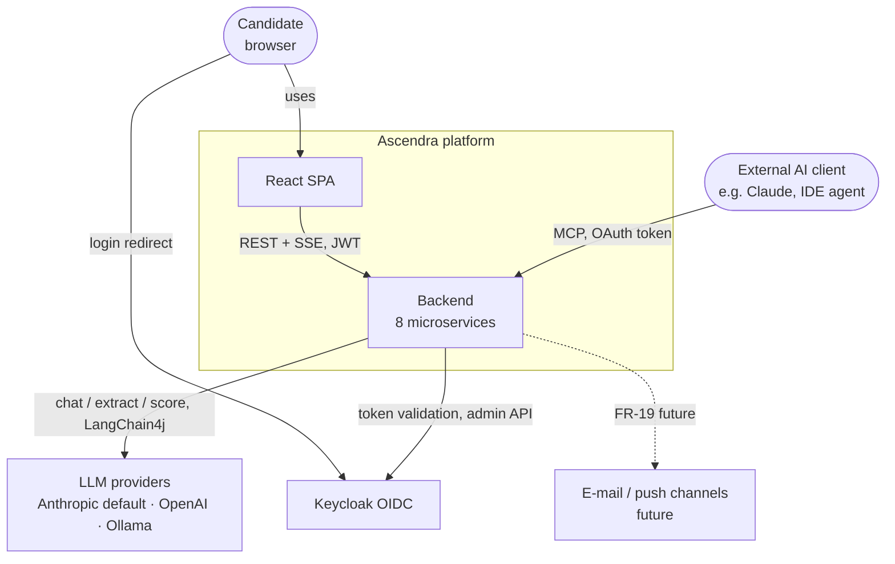
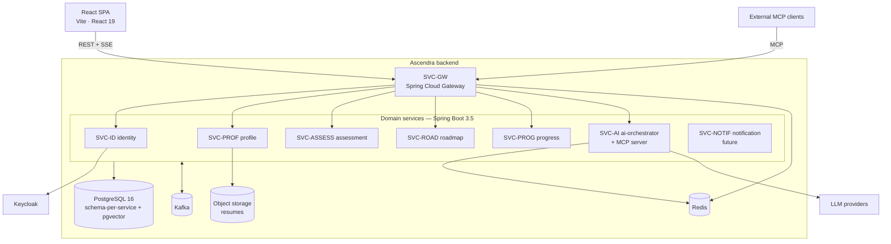
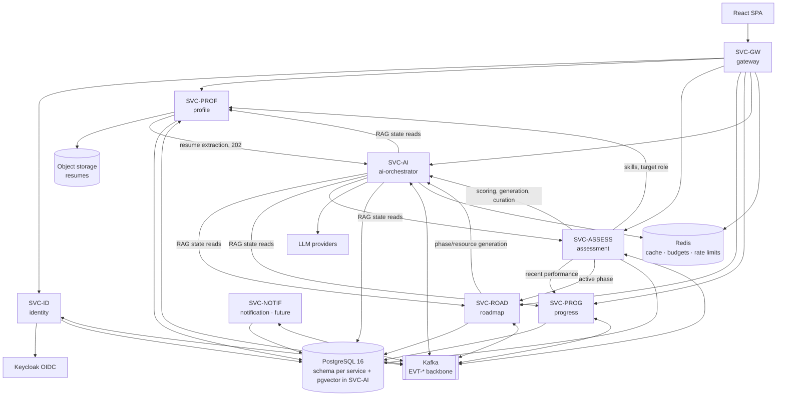
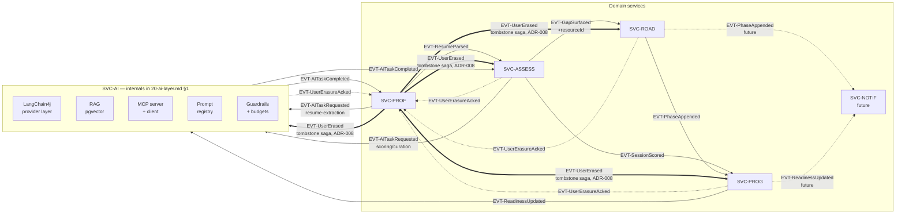

# HLD 00 — Architecture overview

Status: **Active** · Owner: hld-architect · Sources: `.claude/hld/01-requirements.md`, `.claude/specs/00-platform.md`

## 1. Executive summary

Ascendra's backend turns the current mock-serviced SPA into a real, AI-first
platform: a candidate uploads a resume, an LLM extracts a skill inventory, a
personalized 50-question diagnostic establishes a baseline readiness score, and
the platform generates a phased roadmap that **evolves append-only** as daily
drills, adaptive mock interviews, and mock coding tests surface new weaknesses
— every gap and roadmap module carrying a learning resource selected from an
allowlisted catalog (ADR-011). A per-user
RAG-grounded chat ("Ask Ascendra") and an MCP server expose the same
capabilities conversationally and to external AI clients.

The architecture is eight Java 21 / Spring Boot 3.5.x microservices behind a
Spring Cloud Gateway edge, DB-per-service on PostgreSQL 16 (pgvector for
embeddings), Kafka for domain events, Redis for caching/rate limiting, and
Keycloak for OIDC. **All LLM interaction is concentrated in one service,
SVC-AI** (ADR-002), built on LangChain4j with a provider-agnostic model layer
(Claude default — ADR-004). Interactive AI (chat streaming, drill feedback) is
synchronous; heavy scoring (diagnostic, mock) is asynchronous over Kafka with a
visible "scoring" state (ADR-005), which also gives LLM-outage resilience
(NFR-11) for free. GDPR erasure runs as a Kafka saga coordinated by SVC-PROF
(ADR-008).

Requirements are catalogued once in `01-requirements.md` (BR-1…8, FR-01…24,
NFR-01…12) and referenced everywhere by ID; principles and decisions live in
`02-architecture-principles.md` (ADR-001…011).

## 2. C4 — System context

External AI clients reach the platform only through the MCP server (FR-18,
ADR-007); they act with the user's own token — never with elevated access.

## 3. C4 — Container view

One physical PostgreSQL cluster, hard schema-per-service boundaries (no
cross-schema queries — ADR-001, principle 2). pgvector lives in SVC-AI's
schema only (ADR-003).

## 4. C4 — Component view (detailed)

Two diagrams. The first is the full service ↔ data ↔ external-system topology
(more detail than the container view above: every sync dependency and where
each service's state lives). The second is the **event backbone** — the
`EVT-*` choreography across services, which doesn't appear as a single picture
anywhere else in the HLD (per-service docs each show only their own in/out
events). SVC-AI's internals (LangChain4j, RAG, MCP, prompt registry,
guardrails) are diagrammed in full in `20-ai-layer.md` §1 — summarized here
only as a labeled subgraph so this view stays under the diagram size budget.

### 4.1 Service, data & external-system topology

### 4.2 Event backbone (EVT-* choreography)

Full event catalog with payload gists: §7 below.

## 5. Service map

| SVC-ID | Service name | Doc | Responsibility (one line) |
| --- | --- | --- | --- |
| SVC-GW | api-gateway | `10-api-gateway.md` | Single edge: routing, JWT validation, rate limiting, SSE pass-through, embed-origin CSP (FR-23). |
| SVC-ID | identity-service | `11-identity-service.md` | Keycloak-fronted accounts, token lifecycle, plan/tier entitlements. |
| SVC-PROF | profile-service | `12-profile-service.md` | Profile, resume upload/storage, skill inventory (via SVC-AI), notes & TODOs (FR-24), erasure saga coordinator. |
| SVC-ASSESS | assessment-service | `13-assessment-service.md` | Question banks + all session lifecycles (diagnostic/drill/mock/coding); delegates scoring to SVC-AI. |
| SVC-ROAD | roadmap-service | `14-roadmap-service.md` | Gap store + phased roadmap + allowlisted resource catalog (FR-21); append-only evolution from events. |
| SVC-PROG | progress-service | `15-progress-service.md` | Readiness score, trend, session-history projections from events. |
| SVC-AI | ai-orchestrator-service | `16-ai-orchestrator-service.md` | ALL LLM work: chat/RAG, extraction, scoring, generation, MCP server, token budgets. |
| SVC-NOTIF | notification-service | `17-notification-service.md` | **Future** — daily drill delivery and schedule reminders (FR-19). |

## 6. Sync interaction matrix (REST, caller → callee)

| Caller | Callee | Purpose | FRs |
| --- | --- | --- | --- |
| SPA / MCP client | SVC-GW | All external traffic (REST, SSE, MCP) | all |
| SVC-GW | SVC-ID…SVC-AI | Route table in `10-api-gateway.md` | all |
| SVC-PROF | SVC-AI | Submit resume-extraction job (202; result via Kafka) | FR-04 |
| SVC-ASSESS | SVC-AI | Diagnostic question generation; drill feedback (sync ≤ 5 s); adaptive mock follow-ups; resource curation for surfaced gaps | FR-05, FR-12, FR-13, FR-21 |
| SVC-ASSESS | SVC-PROF | Read skill inventory + target role | FR-05, FR-08 |
| SVC-ASSESS | SVC-PROG | Read recent performance for drill selection | FR-11 |
| SVC-ASSESS | SVC-ROAD | Read active phase focus for drill selection | FR-11 |
| SVC-ROAD | SVC-AI | Generate roadmap phases / appended-phase content | FR-09, FR-10 |
| SVC-AI | SVC-PROF, SVC-ROAD, SVC-PROG, SVC-ASSESS | Read user state for RAG refresh, quick actions, MCP tool backing; read resource-catalog candidates for curation | FR-16, FR-17, FR-18, FR-21 |
| SVC-ID | Keycloak | Admin API (registration, entitlement attributes) | FR-01, FR-02 |

Service-to-service calls carry propagated user JWTs plus a service credential
(details in `22-security.md`).

## 7. Async matrix — EVT-* catalog (Kafka)

Derived from the traceability matrix and requirement flows. `EVT-AITaskRequested/Completed`
is the generic durable AI-job pair (ADR-005) — a "diagnostic completed and
awaiting scoring" fact is `EVT-AITaskRequested(taskType=diagnostic-scoring)`.

| Event | Producer | Consumers | Payload gist | FRs |
| --- | --- | --- | --- | --- |
| EVT-AITaskRequested | SVC-PROF, SVC-ASSESS | SVC-AI | `taskId`, `userId`, `taskType` (resume-extraction \| diagnostic-scoring \| mock-scoring \| coding-scoring \| drill-scoring-fallback), input refs | FR-04, FR-07, FR-14, FR-22, NFR-11 |
| EVT-AITaskCompleted | SVC-AI | SVC-PROF, SVC-ASSESS (by taskType) | `taskId`, structured LLM output (JSON-schema-validated), audit record ref (NFR-10) | FR-04, FR-07, FR-14, FR-22 |
| EVT-ResumeParsed | SVC-PROF | SVC-ASSESS, SVC-AI | `userId`, `resumeId`, skill-inventory version + skills[] (name, level, evidence) | FR-04, FR-05 |
| EVT-SessionScored | SVC-ASSESS | SVC-PROG, SVC-AI | `sessionId`, `userId`, `kind` (diagnostic \| drill \| mock \| coding), score, per-competency levels, focus areas | FR-07, FR-12, FR-14, FR-15, FR-22 |
| EVT-GapSurfaced | SVC-ASSESS | SVC-ROAD, SVC-AI | `userId`, `sourceSessionId`, gaps[] (short, long, severity, competency, `resourceId` — allowlisted catalog ref, FR-21) | FR-08, FR-10, FR-14, FR-21, FR-22 |
| EVT-PhaseAppended | SVC-ROAD | SVC-PROG, SVC-AI, SVC-NOTIF* | `userId`, `phaseId`, `sourceSessionId`, phase summary | FR-10 |
| EVT-ReadinessUpdated | SVC-PROG | SVC-AI, SVC-NOTIF* | `userId`, new readiness, delta, trigger session | FR-15, BR-4 |
| EVT-UserErased | SVC-PROF | SVC-ID, SVC-ASSESS, SVC-ROAD, SVC-PROG, SVC-AI, SVC-NOTIF | `userId`, `erasureId`, deadline — tombstone; each consumer purges its data | FR-20 |
| EVT-UserErasureAcked | each consumer above | SVC-PROF | `erasureId`, `svcId`, purge counts — saga completion tracking (ADR-008) | FR-20 |
| EVT-DrillReady *(future)* | SVC-ASSESS | SVC-NOTIF | `userId`, drill date, question count | FR-19 |

\* SVC-NOTIF consumption is future-marked with FR-19.

Conventions: one topic per event type (`asc.<event>` kebab-case), keyed by
`userId` (ordering per user), every event carries `eventId` + `sourceId` for
idempotent consumption (NFR-12). Full schemas in `21-data-architecture.md`.

## 8. Canonical tech stack

| Concern | Choice |
| --- | --- |
| Language / runtime | Java 21 LTS |
| Framework | Spring Boot 3.5.x, Spring Cloud Gateway (edge) |
| AuthN/Z | Spring Security OAuth2 Resource Server + Keycloak (OIDC) |
| Persistence | PostgreSQL 16, schema-per-service, Flyway migrations |
| Vector store | pgvector extension (same PostgreSQL), accessed via LangChain4j `PgVectorEmbeddingStore` |
| Messaging | Apache Kafka (domain events, `EVT-*`) |
| Cache | Redis |
| AI framework | LangChain4j 1.x — `langchain4j-anthropic` (default provider), `-open-ai`, `-ollama` (swap via config), `-pgvector`, `-mcp` |
| LLM strategy | Provider-agnostic ChatModel/StreamingChatModel; Claude default; structured outputs JSON-schema validated |
| API docs | springdoc-openapi per service |
| Observability | Micrometer + OpenTelemetry → Prometheus/Grafana/Tempo/Loki; LLM token + cost metrics first-class |
| Testing | JUnit 5, Testcontainers (Postgres/Kafka), prompt-eval harness for AI flows |
| Dev deploy | Docker Compose |
| Prod deploy | Kubernetes + Helm, HPA, NGINX ingress (SSE-aware) |
| CI/CD | GitHub Actions |

Deviations require an ADR (`02-architecture-principles.md`).

## 9. HLD registry

| Doc | Title | Status |
| --- | --- | --- |
| `00-hld-overview.md` | Architecture overview (this doc) | Active |
| `01-requirements.md` | BR/FR/NFR catalog + traceability | Active |
| `02-architecture-principles.md` | Principles + ADR-001…011 | Active |
| `10-api-gateway.md` | SVC-GW design | Active |
| `11-identity-service.md` | SVC-ID design | Active |
| `12-profile-service.md` | SVC-PROF design | Active |
| `13-assessment-service.md` | SVC-ASSESS design | Active |
| `14-roadmap-service.md` | SVC-ROAD design | Active |
| `15-progress-service.md` | SVC-PROG design | Active |
| `16-ai-orchestrator-service.md` | SVC-AI design (outline; AI internals in doc 20) | Active |
| `17-notification-service.md` | SVC-NOTIF design | Future (thin doc) |
| `20-ai-layer.md` | LangChain4j, RAG, MCP, prompts, guardrails, evals | Active |
| `21-data-architecture.md` | Schemas, pgvector layout, retention/PII | Active |
| `22-security.md` | AuthN/Z, service auth, secrets, AI threat model | Active |
| `23-observability.md` | Metrics/traces/logs, LLM cost telemetry | Active |
| `24-deployment.md` | Compose dev → Kubernetes prod | Active |
| `25-api-contracts.md` | Consolidated endpoint outline per service | Active |
