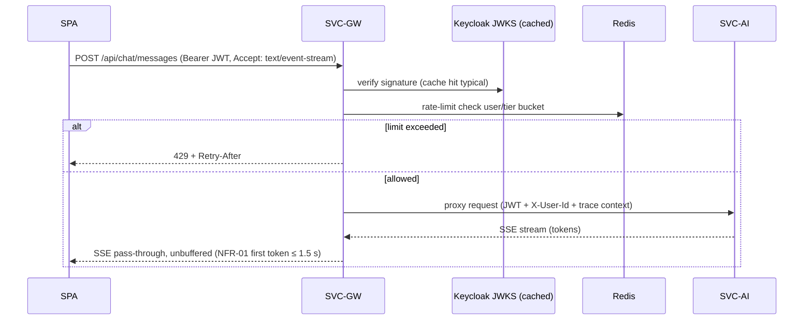

# SVC-GW — api-gateway

Status: **Active** · Template: `_TEMPLATE-service.md` · IDs per `01-requirements.md` / `02-architecture-principles.md`

## Responsibility

SVC-GW is the single edge for all external traffic — the React SPA's REST/SSE
calls and external MCP clients (FR-18) — providing routing, JWT validation,
rate limiting, CORS, and SSE-aware pass-through. It deliberately does NOT
implement any business logic or issue tokens (SVC-ID/Keycloak own identity),
and does NOT terminate/buffer SSE streams (it proxies them verbatim so SVC-AI
controls chat streaming, NFR-01).

## Requirements served

| ID | Requirement (short) | Role of this service |
| --- | --- | --- |
| FR-01 | OIDC auth, token validation for all traffic | contributor (validates JWTs issued via SVC-ID/Keycloak) |
| FR-16 | Streamed chat responses | contributor (SSE pass-through, no buffering) |
| FR-18 | MCP server exposure | contributor (routes + rate-limits MCP traffic to SVC-AI) |
| FR-23 | Coding playground external embeds | owner (edge CSP: `frame-src`/`connect-src` allowlist for `onecompiler.com` and `codesandbox.io` on SPA-serving responses — external embed, no domain service; T-10 in `22-security.md`) |
| NFR-02 | Sync API ≤ 300 ms p95 at the gateway | owner of the measurement point |
| NFR-05 | Stateless horizontal scaling; burst absorption | owner at the edge (rate limiting → queue-friendly backpressure) |
| NFR-07 | Token budgets (request-level backstop) | contributor (per-tier request rate limits; token metering itself is SVC-AI, ADR-010) |

## API surface

SVC-GW exposes no business endpoints of its own — only the routed surface
(consolidated in `25-api-contracts.md`) plus operational endpoints.

Routing table (path prefix → upstream):

| Route prefix | Upstream | Notes |
| --- | --- | --- |
| `/api/auth/**` | SVC-ID | login/refresh/logout brokerage; unauthenticated paths allowlisted |
| `/api/profile/**`, `/api/resume/**`, `/api/privacy/**` | SVC-PROF | multipart upload ≤ 10 MB enforced here first (FR-03) |
| `/api/assessments/**`, `/api/drills/**`, `/api/mocks/**` | SVC-ASSESS | |
| `/api/roadmap/**` | SVC-ROAD | |
| `/api/progress/**` | SVC-PROG | |
| `/api/chat/**` | SVC-AI | SSE — response buffering disabled, idle timeout ≥ 120 s |
| `/mcp/**` | SVC-AI | Streamable HTTP MCP transport; separate rate bucket (ADR-007) |
| `/actuator/health` | local | liveness/readiness |

| Method & path | Purpose | AuthZ |
| --- | --- | --- |
| ANY (routed, above) | Reverse proxy with filters | valid JWT except allowlisted auth paths |

Cross-cutting filters (ordered): TLS termination → correlation/trace-id
injection (NFR-09) → JWT validation (signature, expiry, audience via Keycloak
JWKS, cached) → per-user + per-tier rate limiting (Redis token bucket) →
route. User id and tier claims are forwarded as verified headers alongside the
original bearer token.

## Events

| Direction | Event | Trigger / consumer behavior |
| --- | --- | --- |
| publishes | None | — |
| consumes | None | — |

(SVC-GW is intentionally Kafka-free; edge concerns only.)

## Data model

Owned PostgreSQL schema: **none** (stateless). Redis (shared infra, `gw:`
keyspace): rate-limit token buckets keyed `gw:rl:{userId}:{bucket}` and cached
JWKS. No pgvector usage. Nothing replicated.

## Key flows

Chat SSE pass-through with JWT validation and rate limiting:

Prose: the gateway validates the JWT against cached Keycloak keys, applies the
per-user bucket for the `chat` route class, then proxies with streaming
enabled end-to-end; it never inspects or re-chunks the SSE body. The same
filter chain serves plain REST routes, where it also records the NFR-02
latency histogram per route.

## Scaling & failure modes

- Stateless; scales horizontally behind the K8s ingress (HPA on CPU +
  requests-in-flight). SSE connections are long-lived — connection-count-aware
  scaling and graceful drain on rollout.
- Keycloak JWKS unavailable: continue validating with cached keys (TTL with
  stale-while-revalidate); reject only if a token's `kid` is unknown.
- Redis down: rate limiting fails open (log + metric); JWT validation is
  unaffected (local crypto). NFR-07 backstop temporarily lost — alert.
- Upstream service down: fast 503 with `Retry-After`; circuit breaker per
  route so one sick upstream can't exhaust gateway threads. Core-path routes
  (profile/roadmap/progress) are isolated from AI-route saturation via
  separate connection pools (NFR-04 vs graceful AI degradation, NFR-11).

## NFR compliance

| NFR | Target | How this service meets it |
| --- | --- | --- |
| NFR-01 | first chat token ≤ 1.5 s p95 | zero-buffer SSE proxy; JWKS + rate-limit checks ≤ 5 ms budget |
| NFR-02 | ≤ 300 ms p95 sync APIs at gateway | per-route latency histograms are the SLO measurement; gateway overhead budget ≤ 10 ms p95 |
| NFR-04 | 99.5% core APIs | ≥ 2 replicas, PodDisruptionBudget, circuit breakers, pool isolation |
| NFR-05 | 10k DAU, 10× AI burst | stateless HPA; 429-based backpressure pushes burst into SVC-AI's queue path |
| NFR-09 | 100% traced requests | injects/propagates W3C trace context on every request |

## Open questions

1. Should refresh-token handling be a gateway BFF concern (httpOnly cookie ↔
   bearer exchange) instead of SPA-held tokens? Leaning BFF-lite at SVC-GW —
   decide with `22-security.md` owner; may need an ADR.
2. Per-tier rate numbers (Free vs Pro) need product input before load testing.
