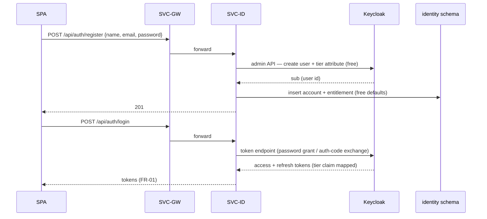

# SVC-ID — identity-service

Status: **Active** · Template: `_TEMPLATE-service.md` · IDs per `01-requirements.md` / `02-architecture-principles.md`

## Responsibility

SVC-ID owns account identity and entitlements: it brokers registration, login,
token refresh, and logout against Keycloak (the actual OIDC provider), and is
the system of record for plan/tier entitlements ("Pro plan") that other
services and the SVC-AI budget interceptor (ADR-010) query. It deliberately
does NOT store profile content (name/target-role/resume — SVC-PROF) and does
NOT validate tokens per-request (SVC-GW + each service's resource-server
config do that locally).

## Requirements served

| ID | Requirement (short) | Role of this service |
| --- | --- | --- |
| FR-01 | OIDC registration, login, token issuance/refresh, logout | owner (Keycloak-fronted) |
| FR-02 | Plan/tier entitlements queryable for gating | owner of entitlement data (SVC-PROF owns the rest of the profile) |
| FR-20 | Account erasure incl. IdP account | contributor (deletes Keycloak user + local rows on EVT-UserErased) |
| NFR-04 | 99.5% core availability | contributor (auth is a core API) |
| NFR-07 | Per-tier token soft limits | contributor (serves tier limits to SVC-AI) |

## API surface

Synchronous endpoints (outline level — full schemas live in `25-api-contracts.md`):

| Method & path | Purpose | AuthZ |
| --- | --- | --- |
| POST `/api/auth/register` | Create account (email + password ≥ 8 chars) via Keycloak admin API; default tier Free | public |
| POST `/api/auth/login` | Exchange credentials for access/refresh tokens (Keycloak token endpoint brokered) | public |
| POST `/api/auth/refresh` | Refresh access token | valid refresh token |
| POST `/api/auth/logout` | Revoke refresh token / end session | authenticated user |
| GET `/api/auth/me` | Token introspection convenience: userId, email, tier | authenticated user |
| GET `/internal/entitlements/{userId}` | Tier + limits (tokens/day, features) for gating | service-to-service (SVC-AI, SVC-GW) |
| PUT `/internal/entitlements/{userId}` | Set tier (billing/admin hook; billing itself out of scope) | admin / service |

## Events

| Direction | Event | Trigger / consumer behavior |
| --- | --- | --- |
| publishes | EVT-UserErasureAcked | after deleting the Keycloak user and local entitlement rows for an erasure saga |
| consumes | EVT-UserErased | delete Keycloak account (admin API) + purge local rows; ack; idempotent on `erasureId` |

## Data model

Owned PostgreSQL schema: `identity`. Keycloak keeps credentials in its own
database — never duplicated here.

- `account` — `user_id (pk, = Keycloak sub)`, `email`, `status
  (active|erasure_pending|erased)`, `created_at`.
- `entitlement` — `user_id (fk)`, `tier (free|pro)`, `daily_token_limit`,
  `features jsonb`, `valid_from`.
- `tier_definition` — `tier`, default limits per feature (source for ADR-010
  budget dimensions).

Replication note: `tier` is also embedded as a JWT claim (Keycloak mapper) so
SVC-GW and services can gate without a call; SVC-ID remains authoritative and
claim staleness is bounded by access-token TTL (≤ 15 min).

## Key flows

Registration and first login:

Prose: registration writes Keycloak first (source of credentials), then the
local account/entitlement rows in one local transaction; a Keycloak success
with a local failure is repaired by an idempotent reconcile on next login.
Login is a thin broker over Keycloak's token endpoint so the SPA never talks
to Keycloak's admin surface; issued JWTs carry `sub` and `tier` claims
consumed platform-wide.

## Scaling & failure modes

- Stateless; horizontal scaling trivial; load is light (auth events, not
  per-request validation).
- Keycloak down: login/refresh fail (surfaced clearly); already-issued access
  tokens keep working platform-wide until expiry — core reads unaffected
  within token TTL (supports NFR-04).
- DB down: entitlement reads fail → SVC-AI budget interceptor falls back to
  JWT tier claim + default limits (fail-degraded, not open).
- EVT-UserErased consumption: retried with backoff until Keycloak deletion
  succeeds; ack only after both purges; dedupe on `erasureId` (NFR-12
  posture).

## NFR compliance

| NFR | Target | How this service meets it |
| --- | --- | --- |
| NFR-02 | ≤ 300 ms p95 | broker endpoints are single Keycloak round-trip + one local query; entitlement reads served from local DB with Redis cache |
| NFR-04 | 99.5% core | ≥ 2 replicas; token-TTL decoupling from Keycloak outages |
| NFR-06 | erasure ≤ 30 days | erasure consumer implemented day one (ADR-008) |
| NFR-07 | per-tier limits | `tier_definition` + `/internal/entitlements` feed SVC-AI enforcement |

## Open questions

1. Password grant vs full auth-code+PKCE redirect for the SPA login screen —
   spec 02 shows an in-app form; PKCE is cleaner security. Decide with
   `22-security.md`; likely needs a small ADR.
2. Billing integration (who calls `PUT /internal/entitlements`) is out of
   scope until a payments FR is catalogued (BR-6 currently gate-only).
