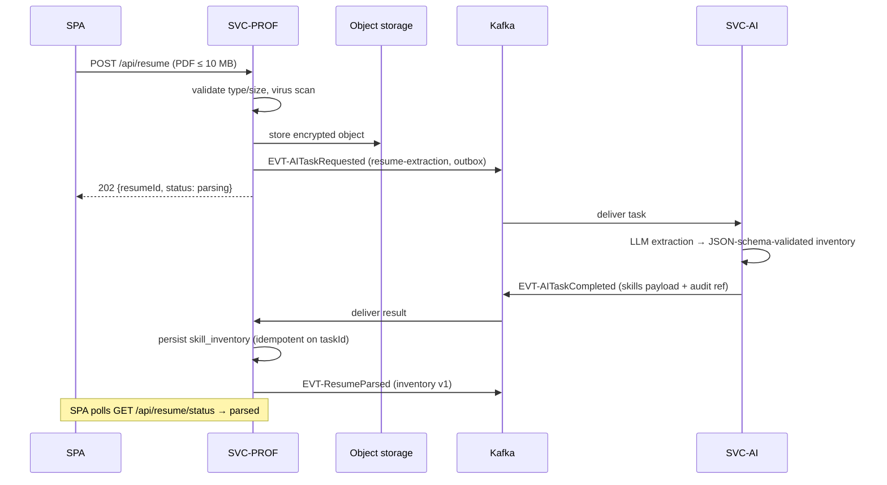

# SVC-PROF — profile-service

Status: **Active** · Template: `_TEMPLATE-service.md` · IDs per `01-requirements.md` / `02-architecture-principles.md`

## Responsibility

SVC-PROF owns the user's profile (name, initials, target role) and everything
resume-related: upload, virus scan, durable object-storage persistence,
triggering LLM extraction via SVC-AI, and storing the resulting skill
inventory that downstream assessment and roadmap generation consume. It also
owns the user's **notes & TODOs aggregate** (FR-24) — small, per-user,
cross-device — and coordinates the GDPR erasure saga (ADR-008). It deliberately does NOT perform
any LLM parsing itself (SVC-AI, ADR-002) and does NOT own credentials or tier
definitions (SVC-ID).

## Requirements served

| ID | Requirement (short) | Role of this service |
| --- | --- | --- |
| FR-02 | Profile with plan/tier display data | owner (tier value read from JWT/SVC-ID) |
| FR-03 | Resume upload (PDF/DOCX ≤ 10 MB), virus scan, durable per-user storage | owner |
| FR-04 | LLM skill-inventory extraction, persisted for downstream | owner (delegates LLM work to SVC-AI) |
| FR-20 | Account data export + hard deletion across services | owner (erasure saga coordinator; notes/todos in export bundle + purge) |
| FR-24 | Server-side notes (autosave) + TODO list, cross-device | owner |
| NFR-06 | Encryption at rest/in transit; erasure ≤ 30 days | owner for resumes; saga coordination |

## API surface

Synchronous endpoints (outline level — full schemas live in `25-api-contracts.md`):

| Method & path | Purpose | AuthZ |
| --- | --- | --- |
| GET `/api/profile` | Profile (name, initials, target role, plan) | user (self) |
| PUT `/api/profile` | Update name / target role | user (self) |
| POST `/api/resume` | Multipart upload (PDF/DOCX ≤ 10 MB) → scan → store → trigger extraction; returns `resumeId`, status `parsing` | user (self) |
| GET `/api/resume/status` | Upload/parse status (`scanning\|parsing\|parsed\|failed`) — SPA polls during onboarding | user (self) |
| GET `/api/profile/skills` | Extracted skill inventory (skills, levels, evidence, version) | user (self) |
| GET `/internal/profiles/{userId}/skills` | Skill inventory + target role for diagnostic assembly / RAG | service (SVC-ASSESS, SVC-AI) |
| GET `/api/notes` | Notes text + `updated_at` (FR-24) | user (self) |
| PUT `/api/notes` | Autosave notes — full-document replace, last-write-wins per user (client debounces; NFR-02 write) | user (self) |
| GET `/api/todos` | TODO list | user (self) |
| POST `/api/todos` | Add TODO (whitespace-only rejected) | user (self) |
| PATCH `/api/todos/{id}` | Toggle done | user (self) |
| DELETE `/api/todos/{id}` | Remove TODO | user (self) |
| POST `/api/privacy/export` | Async account data export bundle (incl. notes/todos) | user (self) |
| POST `/api/privacy/erase` | Start erasure saga (FR-20) | user (self) |
| GET `/api/privacy/erase/{erasureId}` | Saga progress | user (self) |

## Events

| Direction | Event | Trigger / consumer behavior |
| --- | --- | --- |
| publishes | EVT-AITaskRequested (`taskType=resume-extraction`) | after clean scan + object-store write; durable job for SVC-AI |
| publishes | EVT-ResumeParsed | after persisting the skill inventory from the extraction result; consumed by SVC-ASSESS (diagnostic assembly may start) and SVC-AI (RAG indexing) |
| publishes | EVT-UserErased | on erasure request — tombstone opening the saga (ADR-008) |
| publishes | EVT-UserErasureAcked | for its own purge (resume objects, profile rows, notes/todos) as one saga participant |
| consumes | EVT-AITaskCompleted (`taskType=resume-extraction`) | validate structured output, persist `skill_inventory`, publish EVT-ResumeParsed; idempotent on `taskId` |
| consumes | EVT-UserErasureAcked | update saga state; close when all services acked; retry laggards |

## Data model

Owned PostgreSQL schema: `profile`.

- `profile` — `user_id (pk)`, `display_name`, `initials`, `target_role`,
  `created_at`.
- `resume` — `resume_id (pk)`, `user_id`, `object_key`, `mime`, `size_bytes`,
  `scan_status`, `parse_status`, `uploaded_at`. Binary lives in object
  storage (SSE-encrypted bucket, per-user key prefix); DB stores metadata only.
- `skill_inventory` — `inventory_id (pk)`, `user_id`, `resume_id`, `version`,
  `skills jsonb` (name, level, evidence), `extracted_at`, `ai_audit_ref`
  (NFR-10 pointer into SVC-AI's audit store).
- `user_note` — `user_id (pk)`, `text`, `updated_at` — one free-form notes
  document per user; PUT replaces wholesale (last-write-wins, FR-24). Free-text
  PII class: in export bundle, purged by erasure saga.
- `user_todo` — `todo_id (pk)`, `user_id`, `text`, `done`, `seq`,
  `created_at` — same PII/erasure treatment.
- `erasure_saga` — `erasure_id (pk)`, `user_id`, `requested_at`, `deadline`,
  `acks jsonb` (svc → timestamp), `status`.
- `outbox` — transactional outbox for all published events (ADR-009).

Replication note: target role is duplicated into EVT payloads consumed by
SVC-ASSESS — acceptable as point-in-time input to a generated artifact.

## Key flows

Resume upload → extraction → skill inventory (FR-03/FR-04):

Prose: upload is synchronous through the scan and object write (fail fast on
oversize/infected files), then hands off to the durable Kafka job path so an
LLM outage delays parsing without losing the upload (NFR-11). The completion
consumer validates the structured output again at the boundary, versions the
inventory (re-uploads create v2, v3…), and announces `EVT-ResumeParsed` for
SVC-ASSESS and SVC-AI. The erasure saga flow is specified in ADR-008; SVC-PROF
is both coordinator and a participant (object-storage delete + row purge).

## Scaling & failure modes

- Stateless service; horizontal scaling; load shape is bursty small
  (profile reads) plus occasional 10 MB uploads — multipart streamed to
  object storage, never buffered whole in heap.
- SVC-AI/LLM down: uploads still accepted; extraction tasks wait in Kafka;
  status stays `parsing` and the SPA copy reflects it (NFR-11: queue, no loss).
- Object storage down: upload returns 503 (no partial state); reads of
  existing profile/skills unaffected.
- Kafka down: outbox holds events; publisher retries — upload succeeds,
  parsing starts late.
- Consumers idempotent: `taskId` for extraction results, `erasureId` for saga
  events (NFR-12 posture).

## NFR compliance

| NFR | Target | How this service meets it |
| --- | --- | --- |
| NFR-02 | ≤ 300 ms p95 (profile/skills reads) | single-schema indexed reads; skills served from jsonb, no joins |
| NFR-04 | 99.5% core; RPO ≤ 15 min | ≥ 2 replicas; PITR on Postgres; versioned object bucket |
| NFR-06 | AES-256 at rest, TLS 1.3, erasure ≤ 30 days | encrypted bucket + encrypted DB volumes; saga deadline tracking with 80%-window alert |
| NFR-11 | queue on LLM outage | extraction via durable EVT-AITask pair, never sync |

## Open questions

1. Virus-scan engine (ClamAV sidecar vs managed scanning) — deployment-level;
   defer to `24-deployment.md` owner.
2. Export bundle format for FR-20 (JSON archive incl. AI artifacts?) — needs a
   compliance-shaped decision; candidate ADR when FR-20 is implemented.
