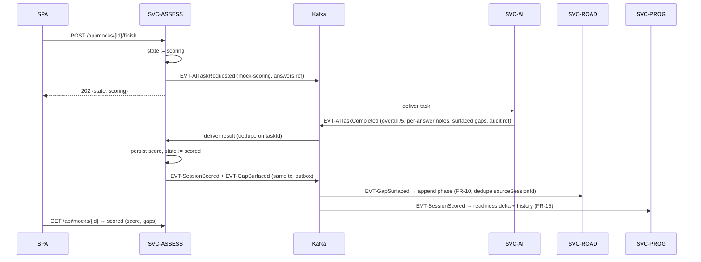

# SVC-ASSESS — assessment-service

Status: **Active** · Template: `_TEMPLATE-service.md` · IDs per `01-requirements.md` / `02-architecture-principles.md`

## Responsibility

SVC-ASSESS owns every assessment artifact and lifecycle: question banks
(including the coding-question bank), diagnostic sessions (assembly,
save/resume, reset), daily drill selection and answer capture, adaptive mock
interview sessions, configurable mock coding tests (FR-22), and the scoring
state machine. It computes the skill-gap report from scored results and publishes
the canonical `EVT-SessionScored` / `EVT-GapSurfaced` facts. It deliberately
does NOT run any LLM call itself — question generation, follow-ups, and all
scoring are delegated to SVC-AI (ADR-002) — and does NOT store readiness or
roadmap state (SVC-PROG, SVC-ROAD consume its events).

## Requirements served

| ID | Requirement (short) | Role of this service |
| --- | --- | --- |
| FR-05 | Personalized 50-question diagnostic assembly | owner (generation delegated to SVC-AI; inventory from SVC-PROF) |
| FR-06 | Answer capture, save-and-exit, resume, re-run | owner |
| FR-07 | Diagnostic scoring → baseline readiness inputs | owner (scoring via SVC-AI async) |
| FR-08 | Skill-gap report (level vs target, strengths, priority gaps, ETA) | owner |
| FR-11 | Daily 10-drill selection from weakest areas | owner (inputs from SVC-PROG, SVC-ROAD) |
| FR-12 | Per-drill LLM feedback (score/10, Strong/Improve) | owner (sync scoring via SVC-AI) |
| FR-13 | Adaptive mock sessions with AI follow-ups | owner (follow-ups via SVC-AI) |
| FR-14 | Mock scoring, gap derivation, exactly-once downstream effects | owner |
| FR-21 | Resource attached to runtime-surfaced gaps at creation | contributor (asks SVC-AI ResourceCurator; resource id rides EVT-GapSurfaced) |
| FR-22 | Configurable mock coding test — config, bank selection, solution capture, AI scoring, exactly-once effects | owner (scoring via SVC-AI async; roadmap/readiness effects via events) |
| FR-15 | Session records as event source | contributor (emits EVT-SessionScored; SVC-PROG projects) |
| NFR-03 | Drill ≤ 5 s sync; diagnostic/mock async with "scoring" state | owner of the state machine (ADR-005) |
| NFR-12 | Exactly-once effects per session | owner (outbox + `sourceSessionId` dedupe keys) |

## API surface

Synchronous endpoints (outline level — full schemas live in `25-api-contracts.md`):

| Method & path | Purpose | AuthZ |
| --- | --- | --- |
| POST `/api/assessments/diagnostic` | Create (or return in-progress) diagnostic session; assembles 50 questions if inventory ready | user (self) |
| GET `/api/assessments/diagnostic/current` | Session + resume position (`diagIdx` semantics, cross-device) | user (self) |
| PUT `/api/assessments/diagnostic/answers/{qIdx}` | Save free-text answer (auto-save = save-and-exit) | user (self) |
| POST `/api/assessments/diagnostic/submit` | Finish → state `scoring`; async scoring kick-off | user (self) |
| POST `/api/assessments/diagnostic/reset` | Re-run: archive old session, start fresh (FR-06) | user (self) |
| GET `/api/assessments/gaps` | Skill-gap report (FR-08) | user (self) |
| GET `/api/drills/today` | Today's 10 selected questions + position | user (self) |
| POST `/api/drills/answers` | Submit answer → sync feedback ≤ 5 s (score/10, Strong/Improve) | user (self) |
| POST `/api/mocks` | Start mock session (level filter, pool from gap areas) | user (self) |
| POST `/api/mocks/{id}/answers` | Submit answer → next/adapted follow-up question | user (self) |
| POST `/api/mocks/{id}/finish` | End session → state `scoring` | user (self) |
| GET `/api/mocks/{id}` | Session incl. score once state = `scored` (SPA polls or SSE) | user (self) |
| POST `/api/coding-tests` | Start coding session with config `{difficulty?, count?, area?}` (defaults random/5/mixed); selects + shuffles from `coding_question` bank (FR-22) | user (self) |
| POST `/api/coding-tests/{id}/solutions` | Submit solution text for current question → next question | user (self) |
| POST `/api/coding-tests/{id}/finish` | End test → state `scoring`; async AI assessment kick-off | user (self) |
| POST `/api/coding-tests/{id}/abandon` | Abandon → state `abandoned` (no scoring, no effects) | user (self) |
| GET `/api/coding-tests/{id}` | Session incl. result (solved/total, weak area, gap + resource) once `scored` | user (self) |
| GET `/internal/sessions/{userId}/recent` | Recent session summaries for RAG/quick actions | service (SVC-AI) |

## Events

| Direction | Event | Trigger / consumer behavior |
| --- | --- | --- |
| publishes | EVT-AITaskRequested (`diagnostic-scoring` \| `mock-scoring` \| `coding-scoring` \| `drill-scoring-fallback`) | on submit/finish (async path, ADR-005) or when sync drill scoring fails over (NFR-11) |
| publishes | EVT-SessionScored (`kind` incl. `coding`) | when a session reaches `scored` — canonical fact for SVC-PROG (readiness/trend/history) and SVC-AI (RAG) |
| publishes | EVT-GapSurfaced | when scoring derives new gaps (diagnostic baseline, mock-surfaced, or coding weak-area) — gaps carry a `resourceId` from the allowlisted catalog (FR-21, ADR-011); consumed by SVC-ROAD (FR-10) and SVC-AI |
| publishes | EVT-DrillReady *(future)* | when a day's drill set is materialized — SVC-NOTIF delivery (FR-19) |
| publishes | EVT-UserErasureAcked | after purging all sessions/answers for an erasure |
| consumes | EVT-AITaskCompleted | persist score + feedback, transition session to `scored`, then publish EVT-SessionScored / EVT-GapSurfaced in the same transaction (outbox); idempotent on `taskId` |
| consumes | EVT-ResumeParsed | mark inventory available; enables diagnostic assembly (FR-05) |
| consumes | EVT-UserErased | purge question sessions, answers, gap reports; ack |

## Data model

Owned PostgreSQL schema: `assessment`.

- `question_bank` — `question_id (pk)`, `area`, `level`, `text`, `origin
  (curated|generated)`, `user_id nullable` (personalized generated questions);
  curated rows double as the NFR-11 fallback pool.
- `coding_question` — `question_id (pk)`, `area` (Arrays & Strings | Data
  Structures | Concurrency | Algorithms | …), `level`, `text`, `rubric jsonb`,
  `active` — curated coding bank feeding FR-22 selection (random/filtered).
- `session` — `session_id (pk)`, `user_id`, `kind (diagnostic|drill|mock|coding)`,
  `state (in_progress|scoring|scored|abandoned)`, `position`, `level_filter`,
  `config jsonb` (coding: `{difficulty?, count?, area?}` — nulls mean random),
  `created_at`, `scored_at`.
- `answer` — `answer_id (pk)`, `session_id`, `question_id`, `q_idx`, `text`
  (coding: solution source, stored verbatim), `score`, `feedback jsonb`
  (strong/improve), `ai_audit_ref` (NFR-10).
- `gap_report` — `user_id`, `version`, `competencies jsonb` (level vs
  target), `strengths jsonb`, `priority_gaps jsonb`, `eta_weeks`,
  `source_session_id`.
- `outbox` — transactional outbox (ADR-009, NFR-12).

Replicated: target role + skill inventory snapshot copied into the session row
at assembly time (point-in-time input; acceptable duplication). No pgvector.

## Key flows

Mock interview finish → async scoring → exactly-once downstream effects
(FR-13/FR-14, ADR-005):

Prose: finishing a mock freezes the answer set and enters `scoring`; the SPA
shows the visible scoring state (NFR-03). SVC-AI returns one structured result
per `taskId`; SVC-ASSESS persists it and emits both downstream facts in the
same DB transaction as the state change via the outbox, so readiness delta and
phase append happen exactly once per session even under redelivery (NFR-12 —
consumers additionally dedupe on `sourceSessionId`). During the session,
`POST /answers` synchronously asks SVC-AI for an adapted follow-up (FR-13);
if SVC-AI is slow/down, the next question falls back to the pre-selected pool
(NFR-11) and the session continues.

Coding-test path (FR-22): the session reuses the same state machine
(`in_progress → scoring → scored`, or `abandoned` — abandon skips scoring and
produces no downstream effects). Create filters the `coding_question` bank by
the config's difficulty/area (fallback: whole bank when a filter empties the
pool), shuffles, and takes `count` (default 5). Solutions are captured per
question; finish freezes them and publishes
`EVT-AITaskRequested(taskType=coding-scoring)` with the solution set + rubric
refs. On `EVT-AITaskCompleted` SVC-ASSESS persists per-solution scores, the
solved/total summary, and the derived weak area; it asks SVC-AI's
ResourceCurator (sync, best-effort) for the catalog resource matching the weak
area (FR-21, ADR-011), then emits `EVT-SessionScored(kind=coding)` and
`EVT-GapSurfaced` (gap `"{area} (coding)"` + `resourceId`) in the same outbox
transaction. Idempotency: downstream consumers dedupe on `sourceSessionId` as
usual, and SVC-ROAD additionally dedupes coding-reinforcement appends per
`(user, area)` so re-testing the same area never duplicates the gap or phase
(spec 07 semantics, NFR-12). The readiness delta is computed by SVC-PROG from
the scored fact (~+3 scale per spec fixture — computed, not fixed).

Drill path (FR-11/FR-12): selection ranks curated+generated questions by gap
severity (own `gap_report`) × recent performance (SVC-PROG) × active phase
focus (SVC-ROAD), materialized daily per user. Answer submission calls SVC-AI
synchronously (≤ 5 s); on timeout the answer is accepted, queued as
`drill-scoring-fallback`, and feedback arrives via polling.

## Scaling & failure modes

- Stateless; horizontal scaling; hottest write path is drill answers (daily
  spike, morning-skewed) — sized for NFR-05 with 10× burst absorbed by the
  async scoring queue.
- SVC-AI down: diagnostic assembly falls back to curated question pool
  (NFR-11); drill/mock/coding submissions accepted and queued; sessions sit in
  `scoring` until recovery — no data loss.
- SVC-PROG/SVC-ROAD down during drill selection: degrade to gap-severity-only
  ranking (inputs are enhancers, not dependencies).
- Kafka down: outbox buffers publishes; scoring stalls but answers persist.
- Event consumption idempotent on `taskId` / `erasureId`; duplicate-delivery
  tests required in CI (NFR-12).

## NFR compliance

| NFR | Target | How this service meets it |
| --- | --- | --- |
| NFR-02 | ≤ 300 ms p95 non-LLM reads | drill set pre-materialized; gap report precomputed at scoring time |
| NFR-03 | drill ≤ 5 s sync; diagnostic/mock/coding ≤ 15 s p95 async | sync REST with 5 s timeout + fallback queue; async job pair with `scoring` state |
| NFR-10 | AI audit retained ≥ 12 months | every score row stores `ai_audit_ref` into SVC-AI's audit store |
| NFR-11 | accept + queue on outage; fallback pools | curated bank fallback; `drill-scoring-fallback` tasks |
| NFR-12 | exactly-once user-visible effects | outbox publish in state-change tx; dedupe keys `taskId`/`sourceSessionId` |

## Open questions

1. Score-ready delivery to the SPA: polling (simplest) vs SSE per session vs
   push over the chat channel — polling for MVP; revisit with frontend.
2. Diagnostic question mix (generated-personalized vs curated ratio) needs
   prompt-eval evidence before fixing a number; owned jointly with
   `20-ai-layer.md`.
3. `EVT-DrillReady` publication schedule (materialize at local morning per
   user?) blocked on FR-19 activation.
