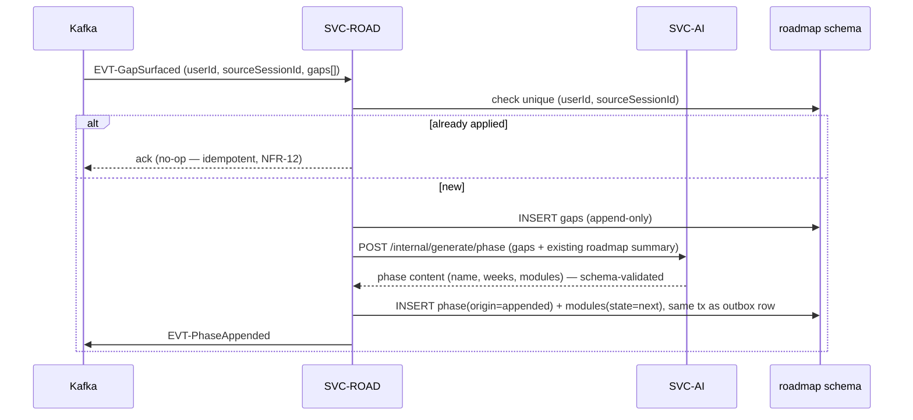

# SVC-ROAD — roadmap-service

Status: **Active** · Template: `_TEMPLATE-service.md` · IDs per `01-requirements.md` / `02-architecture-principles.md`

## Responsibility

SVC-ROAD owns the user's gap store and phased roadmap: the phase → week →
module model with done/active/next state, initial generation from the skill-gap
report, and **append-only evolution** — consuming `EVT-GapSurfaced` to append
new gaps and phases without ever mutating or deleting prior ones (BR-3,
FR-10). It deliberately does NOT compute gaps (SVC-ASSESS derives them from
scoring) and does NOT generate phase content itself (LLM generation delegated
to SVC-AI, ADR-002).

## Requirements served

| ID | Requirement (short) | Role of this service |
| --- | --- | --- |
| FR-08 | Skill-gap report consumption | contributor (stores surfaced gaps as roadmap inputs) |
| FR-09 | Generate phased roadmap from gaps | owner (content generation via SVC-AI) |
| FR-10 | Append-only evolution via events, idempotent per source session | owner |
| FR-11 | Active-phase focus input to drill selection | contributor (serves active phase to SVC-ASSESS) |
| FR-20 | Erasure of roadmap data | contributor (purge on EVT-UserErased) |
| NFR-12 | Idempotent appends (dedupe on session id) | owner for roadmap effects |

## API surface

Synchronous endpoints (outline level — full schemas live in `25-api-contracts.md`):

| Method & path | Purpose | AuthZ |
| --- | --- | --- |
| GET `/api/roadmap` | Full roadmap: phases, weeks, modules, done/active/next state, appended-phase provenance | user (self) |
| POST `/api/roadmap/generate` | Initial generation after diagnostic scoring (idempotent; usually triggered internally) | user (self) |
| PUT `/api/roadmap/modules/{id}/state` | Mark module done → recompute active/next | user (self) |
| GET `/api/roadmap/gaps` | Gap store incl. appended gaps with source-session provenance | user (self) |
| GET `/internal/roadmap/{userId}/active-phase` | Active phase + focus areas for drill selection (FR-11) | service (SVC-ASSESS) |
| GET `/internal/roadmap/{userId}/summary` | Compact roadmap summary for RAG / quick actions | service (SVC-AI) |

## Events

| Direction | Event | Trigger / consumer behavior |
| --- | --- | --- |
| publishes | EVT-PhaseAppended | after a consumed gap batch results in an appended phase — consumed by SVC-PROG (history annotation), SVC-AI (RAG refresh), SVC-NOTIF (future) |
| publishes | EVT-UserErasureAcked | after purging roadmap + gap rows for an erasure |
| consumes | EVT-GapSurfaced | append gaps to the gap store; request phase content from SVC-AI; append phase; **idempotent per `sourceSessionId`** — redelivery appends nothing twice (FR-10, NFR-12) |
| consumes | EVT-UserErased | purge all roadmap/gap data; ack |

## Data model

Owned PostgreSQL schema: `roadmap`. Append-only discipline: `phase` and `gap`
rows are insert-only; only module *state* fields are updatable.

- `gap` — `gap_id (pk)`, `user_id`, `short`, `long`, `severity`,
  `competency`, `source_session_id`, `appended_at`. Unique
  `(user_id, source_session_id, short)` — the idempotency guard.
- `phase` — `phase_id (pk)`, `user_id`, `seq`, `name`, `weeks`,
  `origin (initial|appended)`, `source_session_id nullable`, `created_at`.
  No deletes, no content updates.
- `module` — `module_id (pk)`, `phase_id`, `seq`, `title`,
  `state (done|active|next)`, `state_changed_at` — state is the only mutable
  field in the schema.
- `outbox` — transactional outbox (ADR-009).

Replicated: gap text originates in SVC-ASSESS's scoring output — duplicated
here by design because the roadmap is the long-lived owner of *plan-shaping*
gaps, while SVC-ASSESS keeps the per-report view. No pgvector.

## Key flows

Append-only evolution from a scored mock (FR-10):

Prose: the consumer treats `sourceSessionId` as the dedupe key — a redelivered
or duplicate event finds the unique constraint and no-ops, so one scored mock
yields at most one appended phase (FR-10, NFR-12). Phase content generation is
a synchronous SVC-AI call because it happens off the user's critical path; if
SVC-AI is down, the gap insert commits and phase generation retries from a
pending marker — gaps are never lost, phases arrive late (NFR-11 posture).
Prior phases and modules are never rewritten; the SPA renders appended phases
with their source-session provenance, making cause-and-effect visible (BR-3).

Initial generation (FR-09) follows the same shape triggered by the diagnostic's
`EVT-GapSurfaced` (baseline batch): 4 initial phases, first phase's first
module set `active`.

## Scaling & failure modes

- Stateless; horizontal scaling; low write volume (appends are per-scored-
  session, not per-request); read-heavy `/api/roadmap` served straight from
  indexed rows.
- SVC-AI down: appends defer phase content (pending marker + retry); reads
  unaffected — roadmap is a core API under NFR-04.
- Kafka down: no new appends (by design); reads unaffected; outbox drains on
  recovery.
- Consumer retry posture: at-least-once with the unique-constraint no-op path;
  duplicate-delivery tests in CI (NFR-12).

## NFR compliance

| NFR | Target | How this service meets it |
| --- | --- | --- |
| NFR-02 | ≤ 300 ms p95 | single-query roadmap read (phases + modules join, per-user index) |
| NFR-04 | 99.5% core | ≥ 2 replicas; no LLM dependency on the read path |
| NFR-11 | degrade AI, keep core | phase-append generation deferred, never blocking reads or gap capture |
| NFR-12 | exactly-once appends | `(user_id, source_session_id)` unique guard + outbox publish |

## Open questions

1. Module "done" marking is user-driven today (UI); should drill/mock
   performance auto-complete modules? Would need a new FR — flag to catalog
   before designing.
2. Cap on appended phases (a very active user could grow a long tail) — UX
   question; possibly phase consolidation as a *new* appended summary phase,
   never a rewrite. Needs product input.
