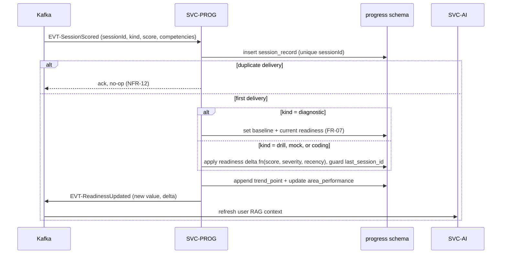

# SVC-PROG — progress-service

Status: **Active** · Template: `_TEMPLATE-service.md` · IDs per `01-requirements.md` / `02-architecture-principles.md`

## Responsibility

SVC-PROG owns the quantified progress view (BR-4): the readiness score and its
computation, the readiness trend over time, and the session-history projection
— all built by consuming events (`EVT-SessionScored`, `EVT-PhaseAppended`)
rather than querying other services. It deliberately does NOT score anything
(SVC-AI via SVC-ASSESS) and does NOT own session artifacts (SVC-ASSESS owns
answers/sessions; SVC-PROG keeps only the projection needed for trend and
history).

## Requirements served

| ID | Requirement (short) | Role of this service |
| --- | --- | --- |
| FR-07 | Baseline readiness from diagnostic | contributor (computes baseline from EVT-SessionScored kind=diagnostic) |
| FR-11 | Recent-performance input to drill selection | contributor (serves per-area recent scores) |
| FR-14 | Readiness delta per scored mock, exactly once | contributor (applies delta idempotently) |
| FR-22 | Computed readiness delta per scored coding test (~+3 scale), exactly once | contributor (same delta path, kind=coding) |
| FR-15 | Record scored sessions; serve trend + history | owner |
| FR-20 | Erasure of progress data | contributor (purge on EVT-UserErased) |
| NFR-12 | Idempotent event consumption | owner for readiness effects |

## API surface

Synchronous endpoints (outline level — full schemas live in `25-api-contracts.md`):

| Method & path | Purpose | AuthZ |
| --- | --- | --- |
| GET `/api/progress/readiness` | Current readiness, target, delta ("+6 pts this week") | user (self) |
| GET `/api/progress/trend` | Readiness trend points over time (monthly/weekly buckets) | user (self) |
| GET `/api/progress/history` | Session history rows (date, kind, score, focus) | user (self) |
| GET `/internal/progress/{userId}/recent-performance` | Per-area recent scores for drill selection (FR-11) | service (SVC-ASSESS) |
| GET `/internal/progress/{userId}/summary` | Readiness + trend summary for RAG / quick actions | service (SVC-AI) |

## Events

| Direction | Event | Trigger / consumer behavior |
| --- | --- | --- |
| publishes | EVT-ReadinessUpdated | whenever readiness changes (baseline set or delta applied) — consumed by SVC-AI (RAG refresh) and SVC-NOTIF (future) |
| publishes | EVT-UserErasureAcked | after purging projections for an erasure |
| consumes | EVT-SessionScored | append `session_record`; recompute readiness (baseline for diagnostic; delta for drill/mock/coding); append trend point; idempotent on `sessionId` |
| consumes | EVT-PhaseAppended | annotate history with plan-evolution markers (cause-and-effect display, BR-3) |
| consumes | EVT-UserErased | purge all projections; ack |

## Data model

Owned PostgreSQL schema: `progress`. All tables are event projections —
rebuildable by replaying `EVT-SessionScored` from Kafka (ADR-009 replay is the
recovery story).

- `readiness` — `user_id (pk)`, `current`, `target`, `baseline`,
  `updated_at`, `last_session_id` (idempotency guard for delta application).
- `trend_point` — `user_id`, `bucket (date)`, `value`, `source_session_id`;
  unique `(user_id, source_session_id)`.
- `session_record` — `record_id (pk)`, `user_id`, `session_id (unique)`,
  `kind`, `score_display`, `focus`, `occurred_at` — the FR-15 history row.
- `area_performance` — `user_id`, `area`, `rolling_score`, `sample_count`,
  `updated_at` — feeds FR-11 drill weighting.

Replicated by design: score/kind/focus duplicated from SVC-ASSESS events —
the whole service is a read-optimized projection; duplication is the point.
No pgvector.

## Key flows

Readiness update from a scored session (FR-14/FR-15):

Prose: every scored session lands exactly one history row, at most one
readiness mutation, and one trend point — the unique `sessionId` constraints
make duplicate deliveries no-ops (NFR-12). The readiness function is a
deterministic computation (weighted by session kind, score, gap severity,
recency), versioned so historical trend points remain explainable; fixture
numbers in the UI (68, +4/mock, +3/coding test) are illustrative only per
`01-requirements.md` §5. `EVT-PhaseAppended` consumption adds "plan extended" annotations to
history so the Progress screen can show cause-and-effect (BR-3, spec 09).

## Scaling & failure modes

- Stateless consumers + read API; horizontal scaling by Kafka partitions
  (keyed `userId` — per-user ordering preserved).
- Kafka down: reads keep serving last projection (core API, NFR-04); readiness
  goes stale, catches up on recovery — consumer lag alert at 5 min.
- DB lost: projections rebuilt by replaying topics (bounded by retention
  policy in `21-data-architecture.md`); RPO backstop is Postgres PITR ≤ 15 min.
- No LLM dependency anywhere — unaffected by provider outages (NFR-11 core
  path).

## NFR compliance

| NFR | Target | How this service meets it |
| --- | --- | --- |
| NFR-02 | ≤ 300 ms p95 trend/history | pre-computed projections; single indexed query per endpoint |
| NFR-04 | 99.5% core; RPO ≤ 15 min | replicas + PITR + event replay rebuild |
| NFR-05 | 10k DAU | partition-parallel consumers; read path cacheable (short-TTL Redis) |
| NFR-12 | exactly-once readiness effects | unique constraints on `sessionId`; duplicate-delivery tests in CI |

## Open questions

1. Readiness formula v1 (weights per session kind, decay window) needs data
   science input; the projection design isolates it behind a versioned
   function so it can iterate without schema change.
2. Trend bucket granularity: UI shows months; store per-session points and
   bucket at read time (recommended) — confirm with frontend before contract
   freeze in `25-api-contracts.md`.
