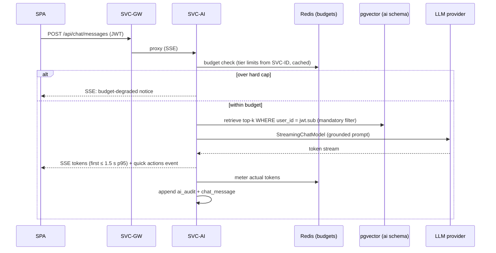

# SVC-AI — ai-orchestrator-service

Status: **Active (outline)** · Template: `_TEMPLATE-service.md` · IDs per `01-requirements.md` / `02-architecture-principles.md`

> **Outline-level doc.** This document fixes SVC-AI's boundary: responsibilities,
> API surface, events, data ownership, scaling posture. The AI internals —
> LangChain4j wiring, RAG pipeline, prompt registry, MCP server/client design,
> guardrails, eval harness — live in `20-ai-layer.md` (authored in parallel);
> this doc references that file without depending on its content.

## Responsibility

SVC-AI owns ALL LLM interaction for the platform (ADR-002): resume skill
extraction, diagnostic question generation, drill/diagnostic/mock scoring,
adaptive follow-up generation, roadmap phase-content generation, the RAG-
grounded "Ask Ascendra" chat with quick actions, the platform MCP server
(ADR-007), embeddings + the pgvector store (ADR-003, ADR-006), per-user token
budgeting (ADR-010), and the NFR-10 AI audit store. It deliberately does NOT
own any domain state — sessions, gaps, roadmap, readiness stay in their
services; SVC-AI reads them (RAG/context) and returns structured outputs, and
does NOT decide *when* AI work happens (domain services trigger it).

## Requirements served

| ID | Requirement (short) | Role of this service |
| --- | --- | --- |
| FR-04 | Resume skill extraction | contributor (executes LLM task for SVC-PROF) |
| FR-05 | Diagnostic question generation | contributor (for SVC-ASSESS) |
| FR-07, FR-12, FR-14 | Diagnostic / drill / mock scoring | contributor (executes; SVC-ASSESS owns lifecycle) |
| FR-09, FR-10 | Roadmap phase content generation | contributor (for SVC-ROAD) |
| FR-13 | Adaptive mock follow-ups | contributor (for SVC-ASSESS) |
| FR-16 | RAG-grounded streaming chat | owner |
| FR-17 | Quick actions with chat responses | owner |
| FR-18 | Authenticated MCP server | owner |
| FR-20 | Purge embeddings + AI artifacts on erasure | contributor |
| NFR-01, NFR-03 | Chat/scoring latency | owner of the LLM-side budget |
| NFR-06 | Per-user RAG isolation | owner (ADR-006) |
| NFR-07, NFR-08, NFR-10, NFR-11 | Budgets, portability, audit, resilience | owner |

## API surface

Synchronous endpoints (outline level — full schemas live in `25-api-contracts.md`;
internal endpoints are service-to-service only):

| Method & path | Purpose | AuthZ |
| --- | --- | --- |
| POST `/api/chat/messages` | Chat turn → SSE token stream + quick actions payload (FR-16, FR-17) | user (self) |
| GET `/api/chat/history` | Recent chat transcript | user (self) |
| `/mcp/*` | MCP server transport: tools readiness, gaps, roadmap, start-drill, schedule-mock (FR-18) | user token (external AI client, ADR-007) |
| POST `/internal/generate/questions` | Diagnostic question set from inventory + role (FR-05) | service (SVC-ASSESS) |
| POST `/internal/generate/followup` | Adapted mock follow-up from session context (FR-13) | service (SVC-ASSESS) |
| POST `/internal/score/drill` | Sync drill scoring ≤ 5 s (FR-12, ADR-005) | service (SVC-ASSESS) |
| POST `/internal/generate/phase` | Phase content from gap batch (FR-09/FR-10) | service (SVC-ROAD) |
| GET `/internal/audit/{auditRef}` | AI audit record retrieval (NFR-10 dispute/review) | service / admin |

Heavy jobs (extraction, diagnostic/mock scoring) arrive via Kafka, not REST —
see Events.

## Events

| Direction | Event | Trigger / consumer behavior |
| --- | --- | --- |
| publishes | EVT-AITaskCompleted | on finishing a durable AI task — structured, JSON-schema-validated output + `auditRef`; routed back to requester by `taskType` |
| publishes | EVT-UserErasureAcked | after purging the user's embeddings, chat history, and audit artifacts |
| consumes | EVT-AITaskRequested | execute resume-extraction / diagnostic-scoring / mock-scoring / drill-scoring-fallback; idempotent on `taskId`; consumer lag is the NFR-11 queue |
| consumes | EVT-ResumeParsed, EVT-SessionScored, EVT-GapSurfaced, EVT-PhaseAppended, EVT-ReadinessUpdated | refresh/re-embed the user's RAG context incrementally so chat "knows the plan" without sync fan-out reads |
| consumes | EVT-UserErased | hard-delete embeddings (pgvector rows by `user_id`), chat transcripts, audit records past legal hold; ack |

## Data model

Owned PostgreSQL schema: `ai`.

- `embedding` — pgvector table via LangChain4j `PgVectorEmbeddingStore`:
  `id`, `embedding vector`, `text`, `metadata jsonb` with **mandatory
  `user_id`** + `source_type`/`source_id` (ADR-006; layout detail in
  `21-data-architecture.md`).
- `chat_message` — `user_id`, `role`, `content`, `quick_actions jsonb`,
  `created_at`.
- `ai_audit` — NFR-10 record: `audit_ref (pk)`, `user_id`, `feature`,
  `prompt_template_version`, `model_id`, `input_digest`, `structured_output
  jsonb`, `rationale`, `token_usage`, `created_at` (retention ≥ 12 months).
- `task` — durable task state for EVT-AITask processing: `task_id (pk)`,
  `type`, `status`, `attempts` (idempotency + retry bookkeeping).

Redis: token-budget counters `ai:budget:{userId}:{feature}:{day}` (ADR-010)
and prompt/context caches (NFR-07 caching ≥ 30%).

Replicated: RAG documents are derived copies of other services' state,
refreshed by events — acceptable because they are rebuildable projections.

## Key flows

Chat turn with per-user RAG isolation and budget enforcement (FR-16/17,
ADR-006/010):

Prose: identity comes only from the verified JWT; the retrieval layer appends
the `user_id` filter unconditionally (defense-in-depth layers and the CI
isolation test per ADR-006). Quick actions (FR-17) are derived from the
retrieved state summaries (readiness, active phase, pending sessions) and sent
as a final SSE event with deep links. Durable tasks follow the
EVT-AITaskRequested/Completed pair with the retry/failover ladder (provider
failover ≤ 60 s, NFR-11). Full pipeline detail: `20-ai-layer.md`.

## Scaling & failure modes

- Stateless app tier; two scaling axes: HPA on SSE connection count for the
  chat path, and Kafka consumer-group parallelism for the task path — the 10×
  AI burst (NFR-05) lands in consumer lag, not error rates.
- LLM provider down: chat emits an explicit degraded notice ≤ 2 s; durable
  tasks accumulate and drain on recovery; automatic failover to the secondary
  provider ≤ 60 s where configured (NFR-11, ADR-004).
- Redis down: budget enforcement fails open with async reconciliation
  (ADR-010); caches bypassed (latency + cost rise — alert on NFR-07 metrics).
- pgvector degraded: chat falls back to ungrounded-but-honest responses
  (states it can't see plan data) rather than failing the stream.
- Task consumption idempotent on `taskId`; poison tasks dead-lettered after
  bounded attempts with alerting.

## NFR compliance

| NFR | Target | How this service meets it |
| --- | --- | --- |
| NFR-01 | first token ≤ 1.5 s p95; retrieval ≤ 300 ms | streaming-first design; filtered HNSW per-user retrieval (small corpus) |
| NFR-03 | drill ≤ 5 s sync; sessions ≤ 15 s p95 async | dedicated sync path with timeout; queue-based heavy scoring (ADR-005) |
| NFR-06 | isolation by construction | ADR-006 layered enforcement + CI isolation gate |
| NFR-07 | ≤ 40k tokens/user/day; cache ≥ 30% | ADR-010 interceptor; prompt/system caching (detail in `20-ai-layer.md`) |
| NFR-08 | config-only provider swap | LangChain4j abstractions only (ADR-004); prompt-eval CI on ≥ 2 providers |
| NFR-09 | LLM spans w/ model, tokens, cost | OTel span per LLM call, budget metrics first-class |
| NFR-10 | audit ≥ 12 months | `ai_audit` written for every scoring/assessment output |
| NFR-11 | degrade + queue + failover ≤ 60 s | task queue, provider failover, fallback behaviors above |

## Open questions

1. Chat history retention (indefinite vs rolling window) — privacy vs "knows
   your plan" continuity; needs a BR-7-shaped decision with `21-data-architecture.md`.
2. MCP write-tools (start-drill, schedule-mock) confirmation semantics for
   external clients — human-in-the-loop flag per tool? Coordinate with
   `20-ai-layer.md` owner.
3. Whether quick-action derivation warrants its own small model call or stays
   rule-based over retrieved state (cheaper, NFR-07-friendlier) — start
   rule-based; measure.
