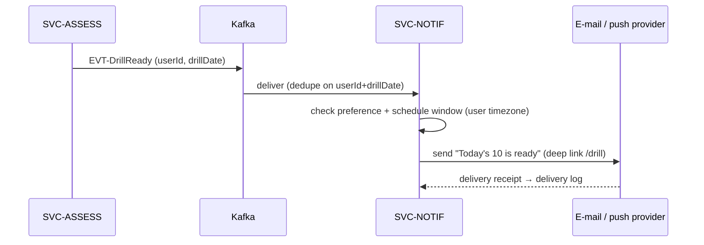

# SVC-NOTIF — notification-service

Status: **Future** — not built in MVP · Template: `_TEMPLATE-service.md` · IDs per `01-requirements.md` / `02-architecture-principles.md`

> Thin doc by design. FR-19 is priority **C** and the UI surface is static copy
> only ("delivered every morning", "Mock loop · Friday 9:00"). This doc
> reserves the service boundary, topics, and schema so nothing else absorbs
> notification concerns in the meantime. Expand via the `update-hld` workflow
> when FR-19 is activated.

## Responsibility

SVC-NOTIF will own outbound notification delivery: the morning daily-drill
delivery and scheduled session reminders (e-mail first, push later), driven by
per-user schedules and channel preferences. It deliberately does NOT decide
*what* the drill contains (SVC-ASSESS materializes drills and announces them)
and does NOT store channel addresses of record (e-mail comes from SVC-ID/
profile; SVC-NOTIF holds preferences + delivery state only).

## Requirements served

| ID | Requirement (short) | Role of this service |
| --- | --- | --- |
| FR-19 | Daily drill delivery + schedule reminders (e-mail/push, per-user morning schedule) | owner *(future)* |
| FR-20 | Erasure of notification data | contributor (purge prefs + delivery log on EVT-UserErased) |

## API surface

Synchronous endpoints (outline level — full schemas live in `25-api-contracts.md`):

| Method & path | Purpose | AuthZ |
| --- | --- | --- |
| GET `/api/notifications/preferences` *(future)* | Channel + schedule preferences | user (self) |
| PUT `/api/notifications/preferences` *(future)* | Update channels/schedule ("Friday 9:00") | user (self) |

## Events

| Direction | Event | Trigger / consumer behavior |
| --- | --- | --- |
| publishes | EVT-UserErasureAcked | after purging preferences + delivery log (implemented even while service is thin — every service joins the erasure saga, ADR-008) |
| consumes | EVT-DrillReady *(future)* | render + send morning drill notification per user schedule |
| consumes | EVT-PhaseAppended, EVT-ReadinessUpdated *(future)* | optional milestone/reminder notifications |
| consumes | EVT-UserErased | purge; ack |

## Data model

Owned PostgreSQL schema: `notification` *(reserved)*.

- `preference` — `user_id (pk)`, `channels jsonb`, `schedule jsonb`
  (cron-like per-user morning slot, timezone), `enabled`.
- `delivery` — `delivery_id (pk)`, `user_id`, `kind`, `channel`, `status`,
  `sent_at` — idempotency guard: unique `(user_id, kind, dedupe_key)` so one
  EVT-DrillReady yields at most one send (NFR-12 posture).

Nothing replicated; e-mail address fetched at send time from SVC-PROF/SVC-ID.

## Key flows

Future morning drill delivery:

Prose: SVC-ASSESS announces drill availability; SVC-NOTIF owns *when/how* to
deliver against the user's schedule and channel preferences, logging exactly
one delivery per drill per user.

## Scaling & failure modes

- Stateless; trivially scaled; send volume ≤ 1–2/user/day at 10k DAU.
- Channel provider down: retry with backoff; drop after the schedule window
  passes (a stale "morning" notification is worse than none).
- Not on any critical path: total absence degrades nothing (FR-19 is Could).
- Consumes with at-least-once + dedupe key (NFR-12 posture).

## NFR compliance

| NFR | Target | How this service meets it |
| --- | --- | --- |
| NFR-05 | 10k DAU | batch sends per schedule tick; stateless workers |
| NFR-06 | erasure ≤ 30 days | erasure consumer from day one |
| NFR-12 | at-most-once user-visible sends | delivery-log unique constraint |

## Open questions

1. E-mail provider choice and push (web-push vs mobile-app-later) — defer
   until FR-19 is promoted from Could.
2. Whether schedule preferences deserve UI (new frontend spec + FR) or start
   API-only with defaults — flag to catalog on activation.
