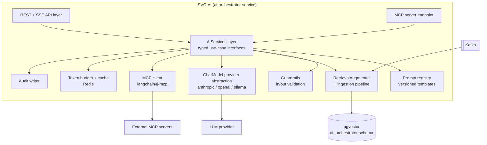
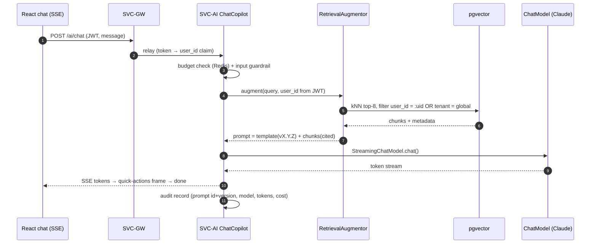
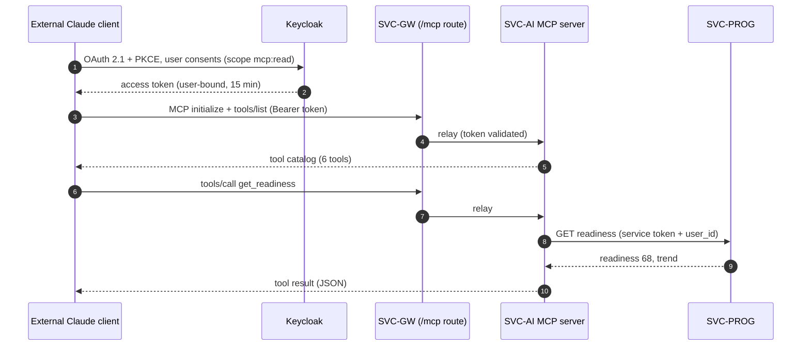

# HLD 20 — AI layer (SVC-AI deep-dive)

Status: **Active** · Owner: hld-architect · Service doc: `16-ai-orchestrator-service.md`
Requirements served: FR-04, FR-05, FR-07, FR-08 (LLM parts), FR-12, FR-13, FR-14, FR-16, FR-17, FR-18 · NFR-01, NFR-03, NFR-06…NFR-11

ALL LLM interaction on the platform is concentrated in **SVC-AI**
(`ai-orchestrator-service`) — no other service holds an LLM API key or builds a
prompt (cross-check ADR on LLM concentration in `02-architecture-principles.md`).
This document is the design of everything inside that boundary: LangChain4j
wiring, RAG, MCP (both directions), and LLM-ops.

---

## 1. Component view

Internal flow for every LLM call: **budget check → prompt assembly (registry) →
RAG augmentation (where applicable) → guardrail input pass → provider call →
output schema validation (retry-with-repair) → audit record → response**.

---

## 2. LangChain4j architecture

### 2.1 Provider abstraction (NFR-08)

All model access goes through LangChain4j's `ChatModel` / `StreamingChatModel`
interfaces. Concrete beans are created by Spring auto-configuration selected by
**configuration only** — Spring profile + properties, zero code change:

| Property (`ascendra.ai.*`) | Default | Notes |
| --- | --- | --- |
| `provider` | `anthropic` | `anthropic` \| `openai` \| `ollama`; selects which `langchain4j-*` starter beans activate (`@ConditionalOnProperty`) |
| `chat-model` | `claude-sonnet-4-5` | interactive chat + adaptive follow-ups |
| `scoring-model` | `claude-haiku-4-5` | high-volume structured scoring (drills); cheaper, faster |
| `heavy-model` | `claude-sonnet-4-5` | resume extraction, diagnostic/mock scoring, gap analysis |
| `fallback-provider` | `openai` | activated by failover (§6.4); `ollama` in dev/air-gapped |
| `timeout`, `max-retries` | 30 s / 2 | per-call; streaming timeout separate (§7) |

Rules:

- Each use case is bound to a **model role** (`chat` / `scoring` / `heavy`),
  never to a provider-specific model id in code. Model ids live only in config.
- CI runs the prompt-eval suite (§6.6) against ≥ 2 providers (Anthropic +
  Ollama) to prove NFR-08 — a prompt that only works on one provider fails the build.
- Provider-specific features (Anthropic prompt caching, §6.3) are applied via a
  decorator on the provider bean; absence degrades gracefully (cache metrics
  report 0%, nothing breaks).

### 2.2 Typed AiServices — one interface per use case

Each use case is a LangChain4j `AiServices` proxy: typed inputs, typed
(JSON-schema-validated) outputs, its own prompt-registry entry, model role,
and RAG configuration. No free-form prompt strings in application code.

| AiService interface | FR | Model role | Structured output (validated JSON schema) | RAG |
| --- | --- | --- | --- | --- |
| `ResumeSkillExtractor` | FR-04 | heavy | `SkillInventory { skills[]: {name, level 1..5, evidence, years?} }` | none (resume text is the input) |
| `DiagnosticAssembler` | FR-05 | heavy | `DiagnosticPlan { questions[50]: {area, level, prompt, rubricRef} }` | question-bank corpus (selection grounding) |
| `AnswerScorer` | FR-07, FR-12 | scoring (drills) / heavy (diagnostic, mock) | `AnswerScore { score, maxScore, strong[], improve[], competencySignals[]: {competency, level}, rationale }` | rubric + question context |
| `AdaptiveFollowUpGenerator` | FR-13 | chat | `FollowUp { question, area, level, reason }` | session transcript (current session only) |
| `GapAnalyzer` | FR-08, FR-14 | heavy | `GapReport { gaps[]: {competency, current, target, severity}, strengths[], estWeeksToTarget }` | assessment results projection |
| `ChatCopilot` | FR-16, FR-17 | chat (streaming) | streamed text + trailing `QuickActions { actions[]: {label, deepLink} }` frame | full per-user RAG (§3) |

Structured-output rules (all scoring paths — NFR-10):

- Output schemas are declared once (Java records + generated JSON schema),
  passed to the provider as response-format/tool schema where supported.
- Every response is validated server-side regardless of provider support;
  invalid → **retry-with-repair** (§6.2), max 2 repairs, then the flow's
  degradation path (§6.4). A score is never persisted from an unvalidated blob.

---

## 3. RAG pipeline

### 3.1 Ingestion

Embedding + storage via `langchain4j-pgvector` → `PgVectorEmbeddingStore` in
the `ai_orchestrator` schema (physical layout in `21-data-architecture.md` §4).

**Embedding model**: in-process ONNX **bge-small-en-v1.5, 384 dimensions**
(`langchain4j-embeddings-bge-small-en`). Rationale: provider-neutral (keeps
NFR-08 — no embedding API dependency on the chat provider; Anthropic has none),
zero per-token cost, ~ms latency, fits the 300 ms retrieval budget (NFR-01).
Trade-off: English-focused, moderate quality — acceptable for grounding over the
user's own short documents. Swapping models requires a re-embedding migration
(dimension change ⇒ new column/index) — flag as ADR territory if raised.

Ingestion is **event-driven**: SVC-AI consumes domain events and (re)ingests the
affected corpus slice. Splitters are LangChain4j `DocumentSplitters.recursive`.

| Corpus (`corpus` metadata) | Source event / feed | Chunking | Notes |
| --- | --- | --- | --- |
| `resume` | EVT-ResumeParsed | recursive, 500 tokens, 50 overlap | parsed text sections; replaced wholesale on re-upload |
| `plan_state` | EVT-PhaseAppended, EVT-ReadinessUpdated, EVT-GapSurfaced | 1 chunk per phase/gap/readiness snapshot (~200 tokens) | compact projection of roadmap + gaps + readiness; upsert by natural key |
| `transcript` | EVT-SessionScored (all session kinds: drill, mock, diagnostic) | per Q&A pair, ≤ 800 tokens | includes score + feedback so chat can cite results |
| `prep_content` | admin-published library (batch job) | recursive, 800 tokens, 80 overlap | shared corpus — the ONLY corpus without `user_id` (marked `tenant=global`) |
| `question_bank` | admin-published (batch job) | 1 chunk per question + rubric | shared; used by DiagnosticAssembler grounding |

Every chunk carries metadata: `user_id` (or `tenant=global`), `corpus`,
`source_id` (event/session/document id — the GDPR erasure handle, FR-20),
`created_at`.

### 3.2 Retrieval — tenant isolation is non-negotiable (NFR-06)

- `RetrievalAugmentor` = `EmbeddingStoreContentRetriever` with a **mandatory
  metadata filter `user_id = <jwt subject>` (OR `tenant = global` for shared
  corpora)**. The filter is built **server-side from the authenticated
  principal** — never accepted from a client parameter, ever. Defense in depth:
  the same predicate is enforced a second time in the store query builder, and a
  CI isolation test (NFR-06) seeds two users and asserts zero cross-user hits.
- Retrieval budget: top-8 chunks, `minScore 0.6`, ≤ 300 ms of the NFR-01 chat
  budget (HNSW index, §21 doc, keeps this in single-digit ms at design load).
- Per-use-case retrieval scoping: ChatCopilot searches all corpora;
  scoring/assembly services pin `corpus` to their slice (table §2.2).

### 3.3 Citation & grounding

- Retrieved chunks are injected with stable markers
  `[S1 corpus=plan_state source=phase-4]…`; the ChatCopilot prompt requires
  claims about the user's own data to cite `[Sn]`.
- The SSE stream's final metadata frame maps citations → deep links (e.g.
  `plan_state/phase-4` → `/roadmap`), which also powers FR-17 quick actions.
- Grounding rule in the system prompt: numbers (readiness, scores, gap counts)
  MUST come from retrieved chunks; if not retrieved, the model must say it
  doesn't have the figure — never invent one (eval-tested, §6.6).

---

## 4. MCP — both directions

### 4.1 MCP server exposed by SVC-AI (FR-18, BR-8)

SVC-AI hosts an MCP server endpoint (Streamable HTTP transport) at the gateway
route `/mcp`, letting external AI clients (Claude Desktop/Code, other agents)
act on the user's behalf.

| MCP tool | Backing capability (internal call) | Scope required | Side effects |
| --- | --- | --- | --- |
| `get_readiness` | SVC-PROG readiness API | `mcp:read` | none |
| `get_skill_gaps` | SVC-ASSESS gap report | `mcp:read` | none |
| `get_roadmap` | SVC-ROAD roadmap API | `mcp:read` | none |
| `get_next_drill` | SVC-ASSESS drill selection | `mcp:read` | none |
| `get_progress_summary` | SVC-PROG trend + history | `mcp:read` | none |
| `start_mock_session` | SVC-ASSESS session create | `mcp:act` | creates a session (write) |

Auth: **OAuth 2.1 authorization-code + PKCE against Keycloak, then token
exchange** — the external client's token is exchanged for a scope-limited
(`mcp:read`, optionally `mcp:act`), short-lived (15 min) access token bound to
one `user_id`. MCP tools can never widen access beyond that user (threat model:
`22-security.md` T-3). Tool results are plain data; the platform never trusts
the external client's model.

### 4.2 MCP client (langchain4j-mcp)

SVC-AI consumes external MCP servers via `langchain4j-mcp` `McpClient` +
`McpToolProvider`, mounted **only** into `ChatCopilot` (chat is the sole
agentic surface; scorers get no tools — determinism + NFR-10).

| External server (future examples) | Tools used | Status |
| --- | --- | --- |
| Calendar scheduling | create/list events ("schedule a mock Friday 9:00", FR-19 adjacency) | designed, not enabled at launch |
| Job-board search | search postings for target role (feeds role targets) | designed, not enabled at launch |

Guardrails on consumed tools: allow-listed servers only (config), tool results
are treated as **untrusted content** (input-guardrail pass before entering the
prompt — `22-security.md` T-4), per-call 10 s timeout, tool-call count ≤ 3 per
chat turn.

---

## 5. Streaming (FR-16, NFR-01)

- End-to-end **SSE**: `StreamingChatModel` → Spring WebFlux `Flux<ServerSentEvent>`
  → SVC-GW passthrough (response buffering disabled on the `/ai/**` routes;
  ingress config note in `24-deployment.md` §3) → React `EventSource`.
- Event protocol: `token` (text delta) → `citations` → `quick_actions` →
  `done { usage }`; `error { degraded: true, fallbackText }` on failure.
- Backpressure: reactive stream backpressure from client socket up to the
  provider stream; slow-consumer buffer cap 64 KB then connection close (client
  reconnects with `Last-Event-ID`, server replays from the Redis-cached partial).
- Timeouts: first token deadline 1.5 s p95 (NFR-01) monitored; hard idle timeout
  20 s between tokens → degrade message; total turn cap 90 s.
- Heartbeat comment frame every 15 s keeps intermediaries from severing idle streams.

---

## 6. LLM-ops

### 6.1 Versioned prompt registry (NFR-10)

- Prompts are **externalized config**, not code: one YAML file per prompt under
  `prompts/<use-case>/<name>.yaml` packaged as a config artifact
  (ConfigMap/mounted volume in K8s), hot-reloadable.
- Each entry: `id`, `semver` (e.g. `answer-scorer@2.3.0`), template, model role,
  output schema ref, eval-set ref, changelog.
- Semver rules: patch = wording, minor = new variables/sections, major =
  schema/behavior change (requires eval-gate pass, §6.6).
- **Every audit record stamps `prompt_id + version` and `model_id`** (NFR-10);
  dashboards slice quality and cost by prompt version (`23-observability.md`).

### 6.2 Guardrails

| Stage | Guardrail | Action on trip |
| --- | --- | --- |
| Input | moderation of user text (chat, answers) — self-harm/abuse categories | chat: safe redirect reply; scoring: score content normally, flag record |
| Input | prompt-injection defense on ALL retrieved/ingested content (resume text, transcripts, MCP tool results): delimiter fencing, "data-not-instructions" system framing, strip role markers / imperative-to-assistant patterns | sanitize + proceed; log detection |
| Output | JSON-schema validation on every structured path | **retry-with-repair**: re-prompt with validator errors appended, max 2; then degradation path §6.4 |
| Output | citation check for chat numeric claims (§3.3) | eval-time gate, runtime log-only |
| Output | PII echo suppression in chat (no verbatim resume dumps > 200 chars) | truncate + summarize |

### 6.3 Token budget & caching (NFR-07)

- **Budget**: ≤ 40k tokens/user/day, metered in Redis
  (`budget:{user_id}:{yyyymmdd}`, atomic INCRBY of actual usage post-call,
  pre-call estimate check). Tier soft limits (BR-6): Free 15k soft-cap → drills
  and chat get shorter contexts + haiku-class model; Pro 40k. At 100%: chat
  degrades to canned guidance; scoring is **queued, never refused** (answers are
  user work — NFR-11 no-data-loss rule wins over budget).
- Alert at 80% of any user/feature budget (NFR-09 → `23-observability.md`).
- **Anthropic prompt caching**: system prompt + rubric + tool definitions marked
  as cache breakpoints; target hit rate ≥ 30% (NFR-07), measured via provider
  usage fields exposed as metrics.
- **Redis response cache**: deterministic non-personal calls only —
  question-bank assembly fragments, canned-guidance renders, follow-up templates
  (key = prompt id+version + input digest, TTL 24 h). Personalized scoring/chat
  is never response-cached.

### 6.4 Provider failover & graceful degradation (NFR-11)

Failover: circuit breaker (Resilience4j) per provider; on open circuit, route
`heavy`/`scoring` roles to `fallback-provider` within ≤ 60 s. Streaming chat
does **not** silently switch mid-turn — the turn fails to the degraded path,
next turn uses the fallback.

| Feature | Primary down / budget exhausted | User experience |
| --- | --- | --- |
| Chat (FR-16) | canned guidance from latest projections (readiness, next drill link) — no LLM | explicit degraded notice ≤ 2 s |
| Drill scoring (FR-12) | accept answer → queue (Kafka) → score on recovery | "scoring…" state, feedback arrives later |
| Mock/diagnostic scoring (FR-07/14) | already async — queue depth grows, no loss | visible "scoring" state persists |
| Follow-ups (FR-13) | pre-generated per-area follow-up pool | slightly less adaptive session |
| Diagnostic assembly (FR-05) | pre-generated question pools per role/level | generic-but-valid diagnostic |
| Resume extraction (FR-04) | queued; onboarding shows pending state | delayed skill inventory |
| MCP server (FR-18) | read tools serve projections (no LLM involved) — unaffected | full function for reads |

### 6.5 Audit (NFR-10)

Every AI score/assessment persists: prompt id+version, model id, provider,
input digest (SHA-256), validated structured output, model rationale, token
usage, latency. Retained ≥ 12 months; retrievable per user; purged via
EVT-UserErased saga (FR-20, `21-data-architecture.md` §6).

### 6.6 Eval harness (NFR-08, quality gate)

- Golden set per prompt id: curated inputs + expected structured outputs /
  rubric assertions (score within ±1, required fields, citation presence,
  no-invented-numbers for chat).
- Runs in CI on every prompt version bump and on provider/library upgrades,
  against ≥ 2 providers (Anthropic + Ollama local model) — NFR-08 proof.
- Regression rule: a major prompt version cannot merge if the golden-set pass
  rate drops below the previous version's baseline (thresholds per prompt,
  default ≥ 95% assertions pass).
- Isolation test (NFR-06) runs in the same suite: two seeded users, assert zero
  cross-tenant retrievals across all corpora.

---

## 7. Events (in/out)

| Direction | Event | Behavior in SVC-AI |
| --- | --- | --- |
| consumes | EVT-ResumeParsed | ingest `resume` corpus (replace slice) |
| consumes | EVT-GapSurfaced, EVT-PhaseAppended, EVT-ReadinessUpdated | upsert `plan_state` corpus |
| consumes | EVT-SessionScored | ingest `transcript` corpus (all session kinds) |
| consumes | EVT-AITaskRequested | run the async AI job (taskType: resume-extraction \| diagnostic-scoring \| mock-scoring \| drill-scoring-fallback) — e.g. diagnostic scoring for FR-07 |
| consumes | EVT-UserErased | delete embeddings + audit rows for user (FR-20 saga step) |
| publishes | EVT-AITaskCompleted | validated structured result + `auditRef`, returned to the requesting service. SVC-AI publishes no DOMAIN events — those are emitted by the owning services (SVC-ASSESS etc.), keeping event semantics with the data owners |

---

## Open questions

1. Embedding model upgrade path (bge-small 384-d → larger/multilingual) — needs
   a re-embedding migration design; cut an ADR when quality data exists.
2. `start_mock_session` via MCP (`mcp:act` scope): enable at launch or hold to
   read-only tools until abuse posture is proven? Recommend read-only launch.
3. Should ChatCopilot memory (multi-turn window) persist across sessions
   (chat_history table) or stay per-connection? Current design: last 10 turns,
   Redis, 24 h TTL — revisit if product wants long-lived chat history.
