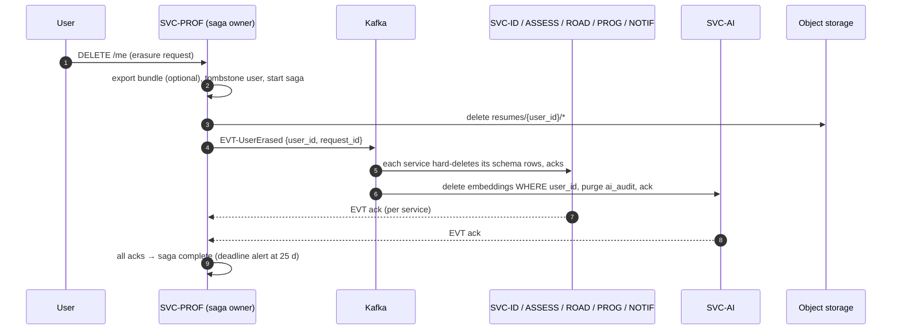

# HLD 21 — Data architecture

Status: **Active** · Owner: hld-architect
Requirements served: FR-03, FR-04, FR-06, FR-10, FR-15, FR-20 · NFR-04, NFR-06, NFR-10, NFR-12

One **PostgreSQL 16 cluster**, logical **schema-per-service** (DB-per-service
pattern at schema granularity — single cluster keeps dev/prod ops simple at 10k
DAU, NFR-05; split to physical clusters later without app change since no
cross-schema queries exist). Flyway migrations per service. pgvector extension
enabled cluster-wide, used only by SVC-AI.

---

## 1. Schema ownership map

Hard rule: a service reads/writes **only its own schema**. Cross-service data
moves via REST (SVC-GW-routed) or Kafka events — never cross-schema SQL.

| Schema | Owning service | Doc | Holds |
| --- | --- | --- | --- |
| `identity` | SVC-ID | `11-identity-service.md` | Keycloak-linked account refs, consent records |
| `profile` | SVC-PROF | `12-profile-service.md` | profiles, entitlements, resume metadata, skill inventory |
| `assessment` | SVC-ASSESS | `13-assessment-service.md` | diagnostics, questions, answers, drills, mock sessions, gap reports |
| `roadmap` | SVC-ROAD | `14-roadmap-service.md` | phases/weeks/modules (append-only), append ledger |
| `progress` | SVC-PROG | `15-progress-service.md` | readiness snapshots, session history |
| `ai_orchestrator` | SVC-AI | `16-ai-orchestrator-service.md`, `20-ai-layer.md` | embeddings (pgvector), AI audit records, prompt-run ledger |
| `notification` | SVC-NOTIF | `17-notification-service.md` | channel prefs, schedules, delivery log |

Object storage (MinIO dev / S3 prod): resume binaries only — bucket
`resumes/{user_id}/{resume_id}` (FR-03), SSE-AES-256, referenced from
`profile.resume`.

---

## 2. Key tables per schema (sketch level)

| Schema.table | Key columns (not full DDL) | Notes |
| --- | --- | --- |
| `identity.account` | id (=Keycloak sub), email, status, created_at | source of `user_id` used everywhere |
| `identity.consent` | user_id, kind, granted_at, revoked_at | GDPR evidence |
| `profile.profile` | user_id PK, name, target_role, plan_tier, initials | plan_tier gates NFR-07 budgets |
| `profile.resume` | id, user_id, object_key, mime, size, scan_status, uploaded_at | binary in object storage |
| `profile.skill_inventory` | user_id, skill, level, evidence, source_resume_id, extracted_at | from FR-04, replaced per re-parse |
| `assessment.diagnostic` | id, user_id, status, position, started_at, completed_at | position = resume-at-position (FR-06) |
| `assessment.question` | id, area, level, prompt, rubric, pool | shared bank + generated |
| `assessment.answer` | id, user_id, session_id, question_id, text, submitted_at | drills + diagnostics + mocks |
| `assessment.score` | answer_id/session_id, score, max, strong, improve, audit_ref → `ai_orchestrator.ai_audit` | audit_ref satisfies NFR-10 lookup |
| `assessment.gap_report` | id, user_id, source_session_id, gaps JSONB, strengths JSONB, created_at | source_session_id = idempotency key (NFR-12) |
| `roadmap.phase` | id, user_id, seq, title, source_event_id, appended_at | **append-only**; UNIQUE(user_id, source_event_id) = FR-10 idempotency |
| `roadmap.module` | id, phase_id, week, title, state | state transitions only (done/active/next) |
| `progress.readiness_snapshot` | user_id, score, delta, source_session_id, at | trend series (FR-15); UNIQUE(user_id, source_session_id) |
| `progress.session_record` | id, user_id, kind, score, summary, at | history feed |
| `notification.schedule` | user_id, kind, cron_expr, channel, enabled | FR-19 |

---

## 3. Data duplication & projection policy

Pattern: **event-carried state transfer** — events carry the full fact needed
by consumers, so consumers persist local projections instead of making
synchronous calls. Duplication is accepted where it removes a runtime coupling;
the owning schema is always the system of record.

| Projection (where) | Source of record | Carried by | Why duplication is OK |
| --- | --- | --- | --- |
| `plan_state` chunks in `ai_orchestrator` | roadmap/progress/assessment schemas | EVT-PhaseAppended, EVT-ReadinessUpdated, EVT-GapSurfaced | chat RAG must not fan out sync calls per turn (NFR-01) |
| transcript chunks in `ai_orchestrator` | `assessment` | EVT-SessionScored (all session kinds) | same; rebuildable from source |
| readiness/session rows in `progress` | scoring facts in `assessment` | EVT-SessionScored (drill, mock, diagnostic kinds) | trend queries stay ≤ 300 ms (NFR-02) without joins |
| gap inputs in `roadmap` append ledger | `assessment.gap_report` | EVT-GapSurfaced | append decision is local + idempotent (FR-10, NFR-12) |
| plan_tier cached in Redis (SVC-AI) | `profile.profile` | profile-change event / TTL 5 min | budget check per LLM call can't call SVC-PROF |

Rules: projections are **rebuildable** (Kafka retention + source-of-record
re-export); consumers dedupe on event key / `source_session_id` (NFR-12);
never expose a projection as an API of record.

---

## 4. pgvector layout (`ai_orchestrator.embedding`)

| Column | Type | Notes |
| --- | --- | --- |
| `id` | UUID PK | |
| `embedding` | `vector(384)` | bge-small-en-v1.5, 384-d (`20-ai-layer.md` §3.1) |
| `text` | text | chunk content |
| `metadata` | JSONB | `{user_id, tenant, corpus, source_id, created_at}` |
| `user_id` | UUID (generated column from metadata) | NOT NULL for user corpora; enables SQL-level isolation + fast erasure |

Indexes:

| Index | Type | Purpose |
| --- | --- | --- |
| `embedding` | **HNSW** (`vector_cosine_ops`, m=16, ef_construction=64) | kNN ≤ 10 ms at 10k DAU scale; chosen over IVFFlat — better recall, no train step, index survives churn from continuous ingestion |
| `(user_id, (metadata->>'corpus'))` | btree | pre-filtered retrieval + erasure delete |
| `(metadata->>'source_id')` | btree | slice replacement on re-ingest |

Isolation defense in depth (NFR-06): retrieval filter injected server-side
(`20-ai-layer.md` §3.2) **plus** optional PostgreSQL row-level security policy
`user_id = current_setting('app.user_id')` on this table — belt and braces,
verified by the CI isolation test.

---

## 5. Retention & PII classification

| Data class | Examples | PII level | Retention | Encryption |
| --- | --- | --- | --- | --- |
| Identity & consent | account, consent | High | life of account + 30 d | TDE at rest, TLS 1.3 |
| Resume binary + parsed text | object storage, `resume`, `skill_inventory`, `resume` embeddings | **High** | until replaced or erasure | AES-256 (SSE) + TLS |
| Answers & transcripts | `answer`, transcript embeddings | High (free text) | life of account | at rest + TLS |
| AI audit records | `ai_audit` | Medium (input digests, rationales) | **≥ 12 months** (NFR-10), then rolling purge | at rest |
| Scores, gaps, readiness | `score`, `gap_report`, snapshots | Medium (derived) | life of account | at rest |
| Shared corpora | `prep_content`, `question_bank` | None | indefinite | at rest |
| Delivery/ops logs | notification log, structured logs | Low (user_id only, no content) | 30 d (logs) / 90 d (delivery) | at rest |

Log rule: prompts, answers, and resume text are **never** written to
application logs — only digests and ids (`22-security.md` T-6,
`23-observability.md` §5).

---

## 6. GDPR erasure flow (FR-20, NFR-06 ≤ 30 days)

Orchestrated saga owned by SVC-PROF; fan-out via **EVT-UserErased**; each
service acks completion. Choreography with a saga-state table in `profile`
(steps, acks, deadline) — no distributed transaction.

- **Tombstone first**: `profile` row flagged erased immediately → all APIs and
  event consumers ignore the user while deletes propagate; Kafka messages for a
  tombstoned user are dropped by consumers (prevents projection resurrection).
- Kafka hygiene: user-keyed compacted topics get null-value tombstones;
  retention on event topics ≤ 14 d bounds residual copies inside the 30 d window.
- Vector store: `DELETE FROM embedding WHERE user_id = :uid` (indexed, §4);
  audit purge overrides the 12-month NFR-10 retention (legal erasure wins).
- Saga is idempotent per `request_id`; unacked step past 25 days pages on-call
  (5-day buffer inside the 30-day NFR-06 window).
- Backups: erased users are not scrubbed from existing backups; backup retention
  (≤ 30 d, §7) guarantees expiry inside the compliance horizon, and restore
  runbooks replay the erasure saga after any restore.

---

## 7. Backup / RPO / RTO (NFR-04: RPO ≤ 15 min, RTO ≤ 1 h)

| Store | Mechanism | RPO | RTO | Notes |
| --- | --- | --- | --- | --- |
| PostgreSQL cluster (all schemas incl. pgvector) | continuous WAL archiving (pgBackRest) + nightly base backup, PITR | ≤ 5 min | ≤ 45 min | one cluster ⇒ one consistent PITR point across schemas |
| Object storage (resumes) | versioned bucket + cross-region replication | ≤ 15 min | ≤ 30 min | |
| Kafka | replication factor 3, min.insync.replicas 2 | ~0 (in-cluster) | broker restart | events replayable; projections rebuildable |
| Redis (budgets, caches, chat window) | none — declared **ephemeral** | n/a | n/a | loss = budget resets to 0 for the day + cold caches; acceptable, documented |
| Embeddings | covered by Postgres PITR; also rebuildable from source events | ≤ 5 min | ≤ 45 min | re-embedding job is the fallback restore |

Restore drill: quarterly PITR restore to staging + smoke suite — an untested
backup does not count toward NFR-04.

---

## Open questions

1. Physical cluster split trigger: define the metric (e.g. sustained > 60% CPU
   or > 500 GB) at which `ai_orchestrator` moves to its own cluster.
2. Column-level crypto (pgcrypto) for `answer.text` vs. relying on disk-level
   TDE — cost/benefit not yet decided; current stance disk-level + strict
   access control.
3. Does data export (FR-20) include AI audit rationales verbatim? Recommend yes
   (transparency), pending product/legal confirmation.
