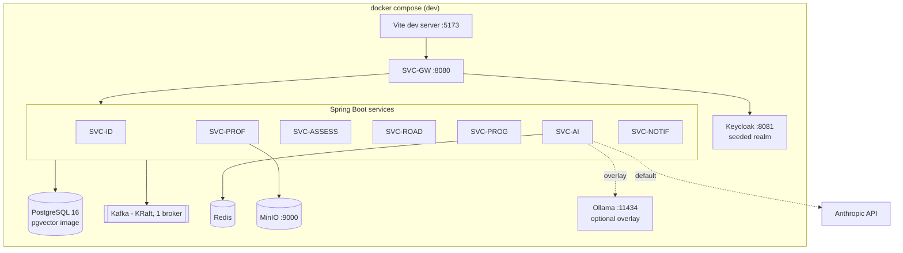

# HLD 24 — Deployment

Status: **Active** · Owner: hld-architect
Requirements served: NFR-04, NFR-05, NFR-08, NFR-11 · plus dev-experience for all services

---

## 1. Dev — Docker Compose

One `docker-compose.yml` (+ `docker-compose.ai.yml` overlay for Ollama) brings
up the entire platform; services run with the `dev` Spring profile, Flyway
migrates on boot, Keycloak imports a seeded realm (demo users), MinIO replaces
S3. `ascendra.ai.provider=ollama` in the overlay gives a fully offline AI stack
(NFR-08 proof in dev).

| Component | Image / note |
| --- | --- |
| PostgreSQL | `pgvector/pgvector:pg16`, one container, all schemas, init script creates per-service roles |
| Kafka | single KRaft broker (no ZooKeeper); topics auto-created by services' admin config |
| Keycloak | dev mode, realm JSON import (clients, demo users — matches `verify-ui` credentials) |
| MinIO | single node, `resumes` bucket bootstrapped |
| Ollama | optional overlay; pulls a small local model + keeps eval suite runnable offline |
| Observability (optional) | `docker-compose.obs.yml`: Prometheus/Grafana/Tempo/Loki + OTel collector — off by default to keep dev light |

## 2. Prod — Kubernetes

| Concern | Decision |
| --- | --- |
| Namespaces | `ascendra-app` (all SVC-*), `ascendra-data` (operators/stateful), `ascendra-obs` (o11y), `ascendra-idp` (Keycloak) |
| Workloads | one **Deployment per service** (stateless, NFR-05), 2 replicas min, PodDisruptionBudget 1 |
| Autoscaling | HPA per service: CPU 70% for core services; SVC-AI additionally scales on custom metric `active SSE streams per pod` (≤ 200) and scoring-queue lag (KEDA on Kafka lag for the async scorer workers) — burst 10× via queue absorption, not overprovisioning (NFR-05) |
| PostgreSQL | **managed service preferred** (RDS/CloudSQL with pgvector) — buys NFR-04 RPO/RTO; self-host fallback: CloudNativePG operator StatefulSet, 1 primary + 1 sync replica, pgBackRest |
| Kafka | managed (MSK/Confluent) preferred; self-host fallback Strimzi, 3 brokers, RF 3 / min.isr 2 |
| Redis | managed or single StatefulSet + replica — declared ephemeral (`21-data-architecture.md` §7), so HA is cheap-tier |
| Keycloak | 2-replica Deployment against its own Postgres schema/db |
| Object storage | cloud S3 (versioned, replicated) |
| Ingress | **NGINX ingress**, TLS 1.3. SSE-aware config on `/ai/**` routes is REQUIRED: `proxy-buffering "off"`, `proxy-read-timeout 120`, `proxy-send-timeout 120`, HTTP/1.1 keep-alive — buffered SSE silently breaks NFR-01 streaming |
| Secrets | **External Secrets Operator** → cloud secret manager (`22-security.md` §3); LLM keys mounted only in SVC-AI; NetworkPolicy: only SVC-AI egresses to LLM provider CIDRs/FQDNs |
| Packaging | **Helm umbrella chart** `ascendra` with one subchart per service + shared library chart (common labels, probes, OTel env); env differences live in `values-<env>.yaml` only |
| Config | prompt registry shipped as a versioned ConfigMap from the prompts artifact (`20-ai-layer.md` §6.1); Spring profiles `dev`/`staging`/`prod` |

## 3. Environment promotion & CI/CD (GitHub Actions)

Environments: **dev (Compose, per-developer) → staging (K8s, prod-shaped, seeded
data) → prod**. Promotion is by **image digest + chart version** — rebuilt
never, retagged never.

| Stage (workflow) | Contents | Gate |
| --- | --- | --- |
| PR: build & test | per-service build, unit tests, Testcontainers (Postgres/Kafka), lint, OpenAPI diff | required checks |
| PR: AI gates | prompt-eval harness vs ≥ 2 providers (Anthropic + Ollama, NFR-08); RAG isolation test (NFR-06); duplicate-delivery tests (NFR-12) | required for changes touching SVC-AI/prompts |
| main: package | build+scan images (SBOM, CVE gate), push to registry, package Helm chart, publish prompts artifact | auto |
| deploy staging | `helm upgrade` umbrella chart; smoke suite + synthetic SSE chat probe; k6 latency spot-check vs NFR-01/02 | auto on main |
| deploy prod | same digests; **manual approval** (GitHub environment protection); progressive rollout (25% → 100% via maxSurge), auto-rollback on SLO burn alert (`23-observability.md` §4) | manual gate |

## 4. Capacity starting points (design point: 10k DAU, NFR-05)

Assumption: ~10% of DAU concurrently active peak ⇒ ~1k concurrent users; AI
bursts absorbed by queues.

| Workload | Replicas (min–max) | CPU req/limit | Mem req/limit | Sizing driver |
| --- | --- | --- | --- | --- |
| SVC-GW | 2–6 | 0.5 / 1 | 512 Mi / 1 Gi | ~300 rps peak edge |
| SVC-ID | 2–3 | 0.25 / 0.5 | 512 Mi / 768 Mi | light |
| SVC-PROF | 2–4 | 0.5 / 1 | 768 Mi / 1 Gi | resume upload spikes |
| SVC-ASSESS | 2–6 | 0.5 / 1 | 768 Mi / 1.5 Gi | busiest domain service |
| SVC-ROAD | 2–4 | 0.25 / 0.5 | 512 Mi / 1 Gi | event-driven appends |
| SVC-PROG | 2–4 | 0.25 / 0.5 | 512 Mi / 1 Gi | read-heavy trend queries |
| SVC-AI (API/SSE) | 2–8 | 1 / 2 | 1.5 Gi / 2.5 Gi | ~400 concurrent SSE streams peak; ONNX embedder in-process |
| SVC-AI scoring workers | 1–10 (KEDA, Kafka lag) | 1 / 2 | 1 Gi / 2 Gi | 10× burst queue drain (NFR-03/05) |
| SVC-NOTIF | 1–2 | 0.25 / 0.5 | 512 Mi / 768 Mi | cron-shaped (FR-19) |
| PostgreSQL | 4 vCPU / 16 Gi / 200 Gi (managed) | — | — | pgvector HNSW resident + OLTP |
| Kafka | 3 × (2 vCPU / 8 Gi / 100 Gi) | — | — | RF 3, 14 d retention |
| Redis | 2 Gi | — | — | budgets + caches + chat windows |

Revisit after first load test in staging; HPA maxima are the burst ceiling, the
requests above are the steady-state bill.

---

## Open questions

1. Managed vs self-hosted Postgres/Kafka is cost-driven — decide per hosting
   budget before staging build-out (architecture supports both).
2. Multi-AZ single-region assumed; multi-region DR is out of scope for NFR-04's
   current targets — revisit if availability target tightens past 99.5%.
3. Canary vs. simple progressive rollout for SVC-AI (prompt changes benefit
   from traffic-split canary + eval-metric comparison) — candidate follow-up.
